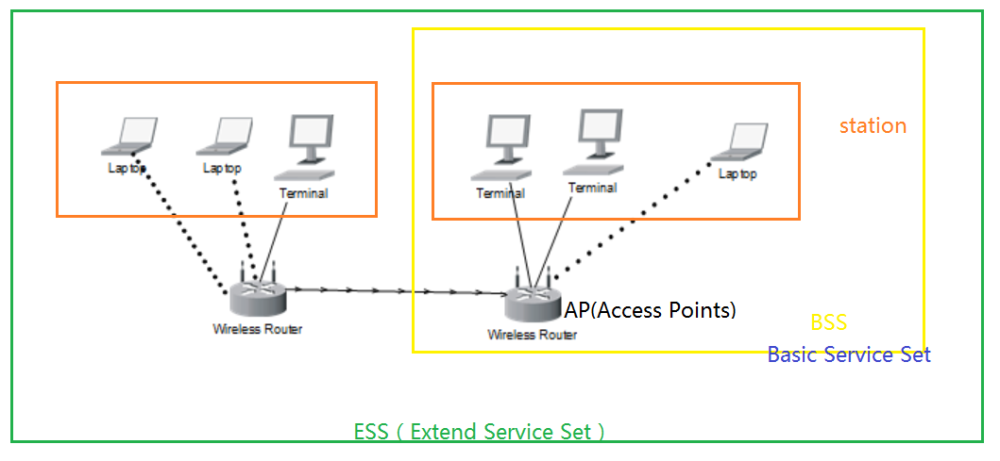
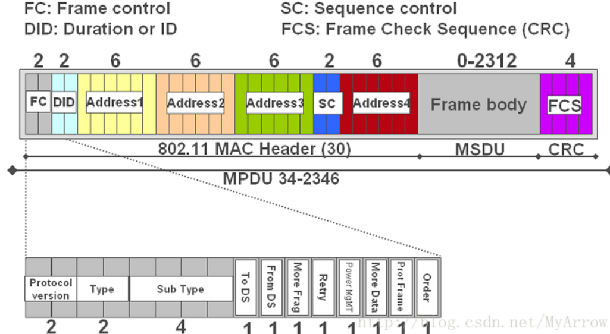
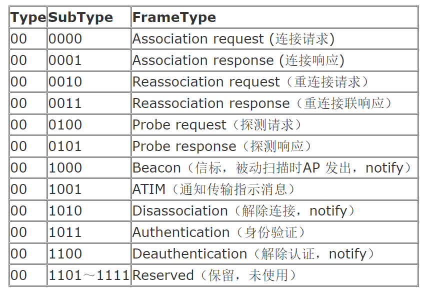
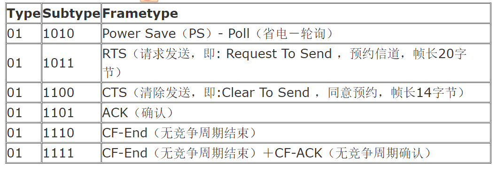
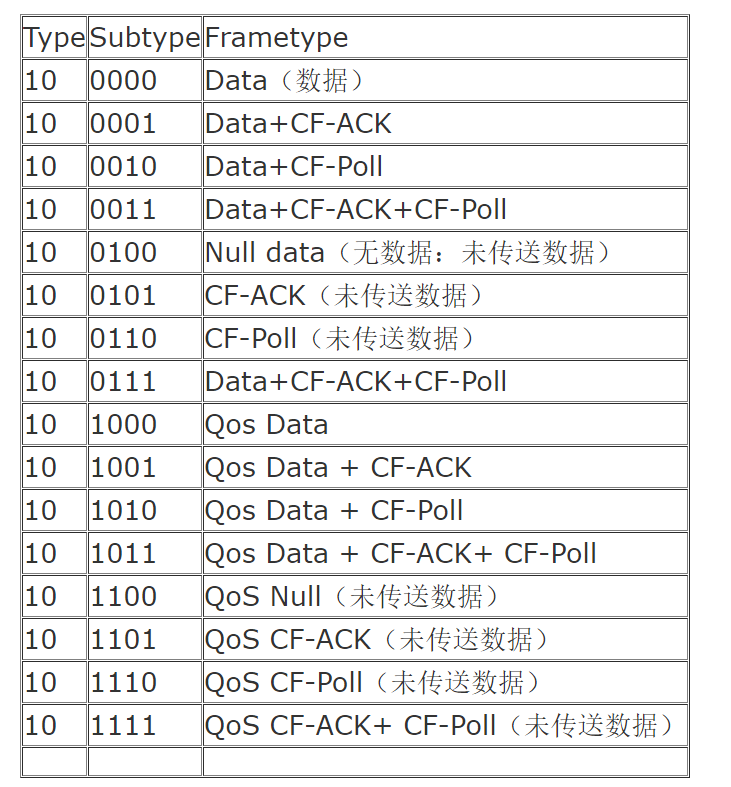
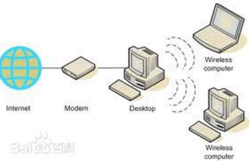

# 802.11

**1.简介**

>SSID（Service Set Identifier）也可以写为ESSID，用来区分不同的网络，最多可以有32个字符，SSID通常由AP广播出来，通过XP自带的扫描功能可以查看当前区域内的SSID。出于安全考虑可以不广播SSID，此时用户就要手工设置SSID才能进入相应的网络。简单说，SSID就是一个局域网的名称，只有设置为名称相同SSID的值的电脑才能互相通信。

>BSSID 是指AP的 MAC 地址.

**2.802.11帧**


```
(1) Frame Control（帧控制域）
     • Protocol Version（协议版本）：通常为0；
     • Type（类型域）和Subtype（子类型域）：共同指出帧的类型；
     • To DS：表明该帧是BSS向DS发送的帧；
     • From DS：表明该帧是DS向BSS发送的帧；
     • More Frag：用于说明长帧被分段的情况，是否还有其它的帧；
     • Retry（重传域）：用于帧的重传，接收STA利用该域消除重传帧；
     • Pwr Mgt（能量管理域）：1：STA处于power_save模式；0：处于active模式；
     • More Data（更多数据域）：1：至少还有一个数据帧要发送给STA ；
     • Protected Frame： 1：帧体部分包含被密钥套处理过的数据；否则：0；
     • Order（序号域）：1：长帧分段传送采用严格编号方式；否则：0。
```
```
(2) Duration/ID（持续时间/标识）    
表明该帧和它的确认帧将会占用信道多长时间；对于帧控制域子类型为：Power Save-Poll的帧，该域表示STA
的连接身份（AID, Association Indentification）。
```
```
(3) Address（地址域）
Address（地址域）：源地址（SA）、目的地址（DA）、传输工作站地址（TA）、接收工作站地址（RA），SA与
DA必不可少，后两个只对跨BSS的通信有用，而目的地址可以为单播地址（Unicast address）、多播地址
（Multicast address）、广播地址（Broadcast address）。
```
```
(4) Sequence Control（序列控制域）
Sequence Control（序列控制域）：由代表MSDU（MAC Server Data Unit）或者MMSDU（MAC Management 
Server Data Unit）的12位序列号（Sequence Number）和表示MSDU和MMSDU的每一个片段的编号的4位片段号
组成（Fragment Number）。
```
```
(5) Frame Body（帧体部分）
包含信息根据帧的类型有所不同，主要封装的是上层的数据单元，长度为0~2312个字节，可以推出，802.11帧最
大长度为：2346个字节；
```
```
(6) FCS（校验域）
包含32位循环冗余码
```

**3. 802.11帧类型**
 
针对帧的不同功能，可将802.11中的MAC帧细分为以下3类：
    • 数据帧：用于在竞争期和非竞争期传输数据；
    • 控制帧：用于竞争期间的握手通信和正向确认(RTS信道预约、CTS预约成功、ACK等)、结束非竞争期等，
为数据帧的发送提供辅助功能；
    • 管理帧：主要用于STA与AP之间协商、关系的控制，如关联、认证、同步等。

     
Frame Control（帧控制域）中的Type（类型域）和Subtype（子类型域）共同指出帧的类型，当Type的B3B2位为00时，该帧为管理帧；为01时，该帧为控制帧；为10时，该帧为数据帧。而Subtype进一步判断帧类型，如管理帧里头细分为关联和认证帧

(1) 管理帧 (Management Frame)


(2) 控制帧 (Control Frame)


(3) 数据帧 (Data Frame)


**4.无线网卡模式**
```
Ad-Hoc（点对点）模式：ad-hoc模式就和以前的直连双绞线概念一样，是P2P的连接，所以也就无法与其它网络
沟通了。一般无线终端设备像PMP、PSP、DMA等用的就是ad-hoc模式。 在家庭无线局域网的组建，我想大家都知
道最简单的莫过于两台安装有无线网卡的计算机实施无线互联，其中一台计算机连接Internet就可以共享带宽。
```

```
Master模式，它主要使用于无线接入点AP提供无线接入服务以及路由功能。可以想象我们使用的无线路由器就是
工作在Master模式下了，不过对于普通的pc机来说，如果有合适的硬件它也可以变成一台无线AP。
```
```
Managed模式用于和无线AP进行接入连接，在这个模式下我们才可以进行无线接入internet上网。
```
```
Monitor模式主要用于监控无线网络内部的流量，用于检查网络和排错
```