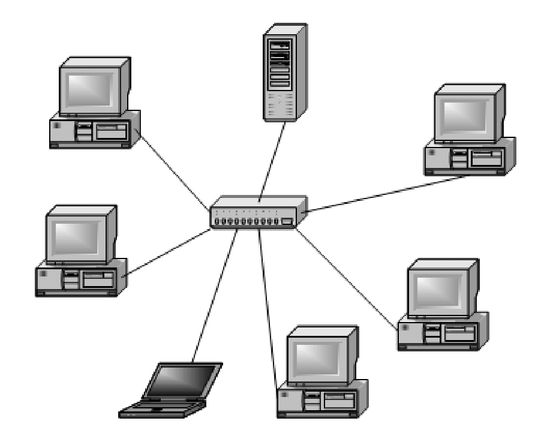
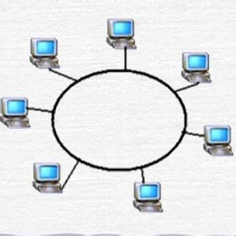
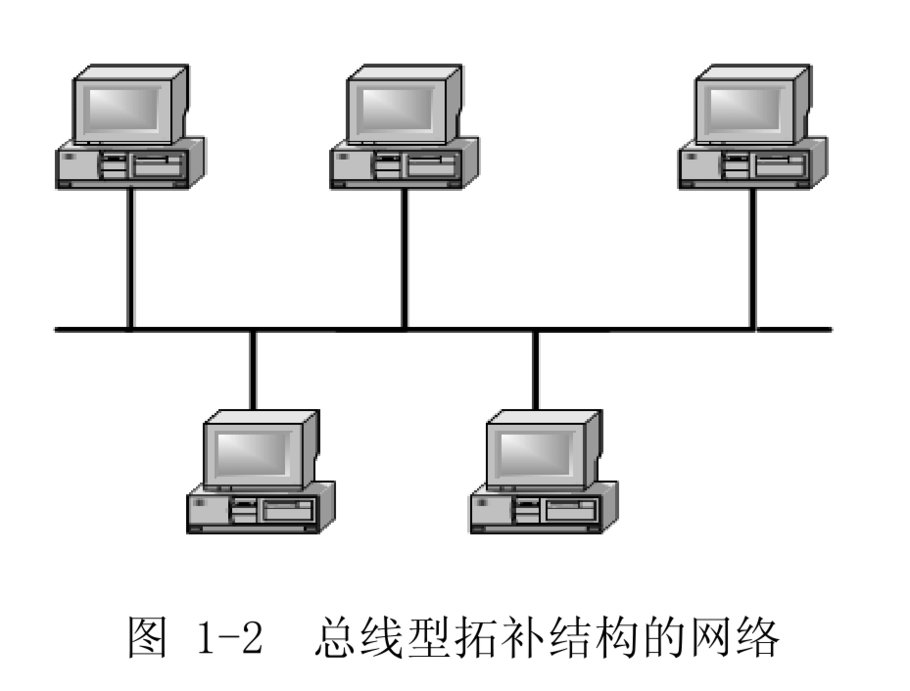

# 802.3

**1.局域网**

>特点：网络为一个单位所拥用，且地理范围和站点数目均有限。以太网属于局域网的主流标准

<br/>

**2.局域网拓扑**

(1).星形网
星形拓扑是由中央节点和通过点对点链路链接到中央节点的各站点（网络工作站等） 。



(2).环形网
环形拓扑由一些中继器和链接中继器的点到点链路首尾相连形成一个闭合的环。



(3).总线网
总线拓扑采用单根传输线作为传输介质、所有的站点都通过相应地硬件接口直接链接到传输介质上、任何一个站点发送的信息都可以沿着介质传播。而且能被其他所有站点接收。。



<br/>

**3.CSMA/CD协议(半双工)**：载波监听多点接入/碰撞检测(Carrier Sence Multiple Access with Collision Detection)
```
(1)多点接入：总线型网络
(2)载波监听：发送前先监听，如果其他站在发送数据则暂时不发送
(3)碰撞检测：边发送边监听，发送数据的同时检测总线信号电压来判断其他站是否在发送数据。档一个站检测
到总线上的信号电压超过一定的阈值(超过阈值传输的信号会发生明显的失真)时，既表示总线上至少有两个站在
发送数据，碰撞产生，适配器立刻停止发送。
```

<br/>

**4.争用期**

```
争用期：经过争用期这段时间还没有检测到碰撞，才能肯定这次发送不会发生碰撞。（51.2μs）
截断二进制指数退避：用来确定重传的时机。
无效帧：凡是长度小于64字节的帧都是由于冲突而异常终止的无效帧，因此数据链路帧（64~1518）。
强化碰撞：当发送数据的站一旦发现发生了碰撞时，除了立即停止发送数据外，还需要发送32比特或48比特的人为干扰信号。
```
