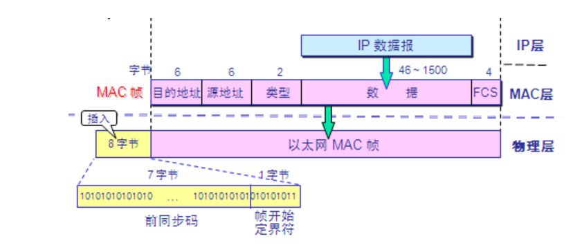

# 802.3

**1.局域网**

>特点：网络为一个单位所拥用，且地理范围和站点数目均有限。以太网属于局域网的主流标准

<br/>

**2.局域网拓扑**

(1).星形网

星形拓扑是由中央节点和通过点对点链路链接到中央节点的各站点（网络工作站等） 。


(2).环形网

环形拓扑由一些中继器和链接中继器的点到点链路首尾相连形成一个闭合的环。


(3).总线网

总线拓扑采用单根传输线作为传输介质、所有的站点都通过相应地硬件接口直接链接到传输介质上、任何一个站点发送的信息都可以沿着介质传播。而且能被其他所有站点接收。。


<br/>

**3.CSMA/CD协议(半双工)**：载波监听多点接入/碰撞检测(Carrier Sence Multiple Access with Collision Detection)

```
(1)多点接入：总线型网络
(2)载波监听：发送前先监听，如果其他站在发送数据则暂时不发送
(3)碰撞检测：边发送边监听，发送数据的同时检测总线信号电压来判断其他站是否在发送数据。档一个站检测
到总线上的信号电压超过一定的阈值(超过阈值传输的信号会发生明显的失真)时，既表示总线上至少有两个站在
发送数据，碰撞产生，适配器立刻停止发送。
```

<br/>

**4.争用期**

```
争用期：经过争用期这段时间还没有检测到碰撞，才能肯定这次发送不会发生碰撞。（51.2μs）
截断二进制指数退避：用来确定重传的时机。
无效帧：凡是长度小于64字节的帧都是由于冲突而异常终止的无效帧，因此数据链路帧（64~1518）。
强化碰撞：当发送数据的站一旦发现发生了碰撞时，除了立即停止发送数据外，还需要发送32比特或48比特的人为干扰信号。
```

<br/>

**5.MAC地址**：硬件地址或者物理地址，固化在网卡里面的物理地址。

>MAC（Medium/Media Access Control）地址，用来表示互联网上每一个站点的标识符，采用十六进制数表示，共六个字节（48位）。其中，前三个字节是由IEEE的注册管理机构RA负责给不同厂家分配的代码(高位24位），也称为“编制上唯一的标识符”（Organizationally Unique Identifier），后三个字节(低位24位)由各厂家自行指派给生产的适配器接口，称为扩展标识符（唯一性）。MAC地址实际上就是适配器地址或适配器标识符EUI-48。

<br/>

**6.MAC帧格式：**



```
(1).目的地址，源地址：分别为6个字节的MAC地址，
(2).类型：2个字节，用来标志上一层用了什么协议
(3).数据字段：46-1500字节(最短有效帧长64减去首部和尾部的16个字节，得出46字节)
(4).FCS字段：进行CRC校验
以下不属于Mac帧，是物理层的
(5).前同步码：7字节，用于使接收端的适配器在接受MAC帧时能迅速调整到其时钟频率
(6).帧开始定界符：1字节，顾名思义！
```

>Tips:此处不需要帧结束定界符时因为采用了曼彻斯特编码，当电压不在变化的时候就代表结束了；以太网在传送帧时，各帧之间还必须有一定的间隙

<br/>

**7.以太网工作模式**

```
1）广播模式（Broad Cast Model）:它的物理地址（MAC）地址是 0Xffffff 的帧为广播帧，工作在广播模式的网卡接收
广播帧。
```

```
2）多播传送（MultiCast Model）：多播传送地址作为目的物理地址的帧可以被组内的其它主机同时接收，而组外主机却接
收不到。但是，如果将网卡设置为多播传送模式，它可以接收所有的多播传送帧，而不论它是不是组内成员。
```

```
3）直接模式（Direct Model）:工作在直接模式下的网卡只接收目地址是自己 Mac地址的帧。
```

```
4）混杂模式（Promiscuous Model）:工作在混杂模式下的网卡接收所有的流过网卡的帧，信包捕获程序就是在这种模式下
运行的。网卡的缺省工作模式包含广播模式和直接模式，即它只接收广播帧和发给自己的帧。如果采用混杂模式，一个站点
的网卡将接受同一网络内所有站点所发送的数据包这样就可以到达对于网络信息监视捕获的目的。
```
