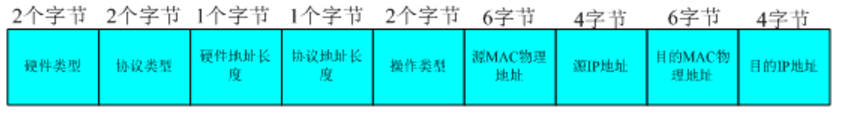

#ARP

**1. ARP(Address Resolution Protocol)地址转换协议**

(1) ARP工作流程：A以广播方式发送ARP请求(需要得到B的硬件地址)，B收到请求之后以单播方式给A发送ARP响应，此时B把A的IP地址和MAC地址存在高速ARP缓存内以便下一次发送，A收到B的响应之后，也在自己的ARP缓存中写入B的IP地址和MAC地址映射。

(2)高速ARP缓存：映射地址都有一定的生存周期,超过就直接丢弃。

**2.RARP(RARP：Reverse Address Resolution Protocol)反向地址转换协议**

将局域网中某个主机的物理地址转换为IP地址，比如局域网中有一台主机只知道物理地址而不知道IP地址，那么可以通过RARP协议发出征求自身IP地址的广播请求，然后由RARP服务器负责回答。RARP协议广泛应用于无盘工作站引导时获取IP地址。

RARP允许局域网的物理机器从网管服务器ARP表或者缓存上请求其IP地址。

**3.ARP报文各字段含义**

（1）.硬件类型：占2个字节，表明ARP实现在何种类型的网络上。
值为1：表示以太网。
（2）.协议类型：占2个字节表示要映射的协议地址类型。
IP:0800
（3）.硬件地址长度：占1个字节，表示 MAC地址长度，其值为6个字节。
（4）.协议地址长度：占1个字节，表示IP地址长度，此处值4个字节
（5）.操作类型 ：占2个字节，表示ARP数据包类型。
 值为1表示ARP请求。值2表示ARP应答。
（6）.源MAC地址：占6个字节，表示发送端MAC地址
（7）.源IP地址:占4个字节，表示发送端IP地址
（8）.目的以太网地址：占6个字节，表示目标设备的MAC物理地址
（9）.目的IP地址：占4个字节，表示目标设备的IP地址.

	注意：在ARP操作中，有效数据的长度为28个字节，不足以太网的最小长度46字节长度，需要填充字节，填充字节最小长度为18个字节

**4.ARP请求分组或应答分组**

以太网首部总共有12字节数据，arp请求报文总共有28字节。所以一个ARP请求分组或应答分组总共有40字节数据。而以太网数据包的最小数据为46字节。所以，要对其进行填充。

这里有一些重复信息
（1）.  在以太网的数据帧报头中和ARP请求数据帧中都有发送端的MAC物理地址。
（2）.  在发送ARP请求时，以太网帧头中的目的MAC物理地址为FF-FF-FF-FF-FF-FF,而在ARP帧中的目的MAC处此时为空。
（3）.  对一个ARP请求来说，除ARP中目的端MAC硬件地址外的所有其他的字段都有填充值。当系统收到一份目的端为本地的ARP请求报文后，它就把硬件地址填进去，然后用两个目的端地址分别替换两个发送端地址，并把操作字段置为2，最后发送出去。

**5.ARP其他方面**

（1）.交换网络的嗅探

【ARP协议并不只在发送了ARP请求才接收ARP应答】

当计算机接收到ARP应答数据包的时候，就会对本地的ARP缓存进行更新，将应答中的IP和MAC地址存储在ARP缓存中。
因此，在上面的假设网络中，B向A发送一个自己伪造的ARP应答，而这个应答中的数据为发送方IP地址是192.168.10.3（C的IP地址），MAC地址是DD-DD-DD-DD-DD-DD（C的MAC地址本来应该是CC-CC-CC-CC-CC-CC，这里被伪造了）。当A接收到B伪造的ARP应答，就会更新本地的ARP缓存，将本地的IP-MAC对应表更换为接收到的数据格式，由于这一切都是A的系统内核自动完成的，A可不知道被伪造了。ARP欺骗的主要用途就是进行在交换网络中的嗅探。

（2）.IP地址冲突
【如果网络中存在相同IP地址的主机时候，就会报告出IP地址冲突的警告。】

 比如某主机B规定IP地址为192.168.0.1，如果它处于开机状态，那么其他机器A更该IP地址为192.168.0.1就会造成IP地址冲突。

其原理是：主机A在连接网路（或更改IP地址）的时候就会向网络发送ARP包广播自己的IP地址，也就是free arp(免费ARP).如果网络中存在相同IP地址的主机B，那么B就会通过ARP来reply该地址，当A接收到这个reply后，A就会跳出IP地址冲突的警告，当然B也会有警告。因此用ARP欺骗可以来伪造这个ARPreply，从而使目标一直遭受IP地址冲突警告的困扰。

（3）.阻止目标的数据包通过网关

比如在一个局域网内通过网管上网，那么连接外部的计算机上的ARP缓存中就存在网管IP-MAC对应记录，如果，该记录被更改，那么该计算机向外发送的数据包总是发送到了错误的网关硬件地址上，这样，该计算机就不能上网了。
这里也主要是通过ARP欺骗进行的。有两种方法达到这样的目的：

（1）向目标发送伪造的ARP应答数据包，其中发送方的IP地址为网管的地址，而MAC地址则为一个伪造的地址。当目标接收到ARP包，那么就更新自身的ARP缓存。如果该欺骗一直持续下去，那么目标的网管缓存一直是一个被伪造的错误记录。不过，如果使用arp –a,就知道问题所在了。

（2）第二种方法是欺骗网管。向网管发送伪造的ARP应答数据包，其中发送方的IP地址为目标的IP地址，而MAC地址则为一个伪造的地址。这样，网管上的目标ARP记录就是一个错误的，网管发送给目标的数据报都是使用了错误的MAC地址。这种情况下，目标能够发送数据到网管，却不能接收到网管的任何数据。同时，目标自己查看arp –a却看不出任何问题来。

（4）.通过检测混杂模式节点

在混杂模式中，网卡进行包过滤不同于普通模式。本来在普通模式下，只有本地地址的数据包或者广播（多播等）才会被网卡提交给系统核心，否则的话，这些数据包就直接被网卡抛弃。现在，混合模式让所有经过的数据包都传递给系统核心，然后被sniffer等程序利用。 　　

通过特殊设计的ARP请求可以用来在一定程度上检测处于混杂模式的节点，比如对网络中的每个节点都发送MAC地址为FF-FF-FF-FF-FF-FE的ARP请求。对于网卡来说这不是一个广播地址（FF-FF-FF-FF-FF-FF），所以处于普通模式的节点就会直接抛弃该数据包，但是多数操作系统核心都认为这是一个广播地址，如果有一般的sniffer程序存在，并设置网卡为混杂模式，那么系统核心就会作出应答，这样就可以判断这些节点是否存在嗅探器了。

可以查看，很多基于ARP的攻击都是通过ARP欺骗实现的。至于ARP欺骗的防范，还是尽可能使用静态的ARP。对于WIN，使用arp-s来进行静态ARP的设置。

当然，如果能够完全使用静态的IP+MAC对应，就更好了，因为静态的ARP缓存只是相对的。当然，可以有一些方法来实现ARP欺骗的检测。设置一个ARP的嗅探器，其中维护着一个本地网络的IP-MAC地址的静态对应表，查看所有经过的ARP数据，并检查其中的IP-MAC对应关系，如果捕获的IP-MAC对应关系和维护的静态对应关系对应不上，那么就表明是一个欺骗的ARP数据包了。