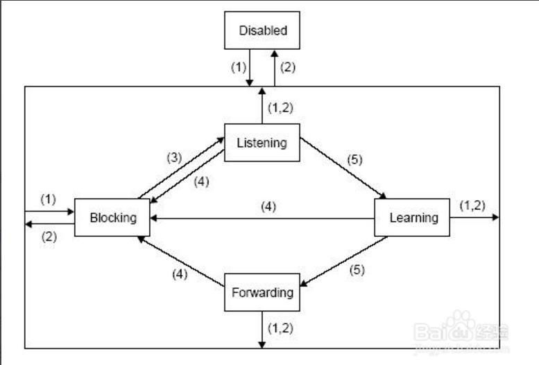
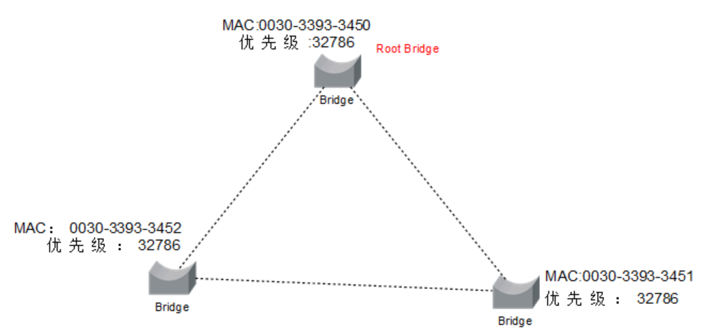
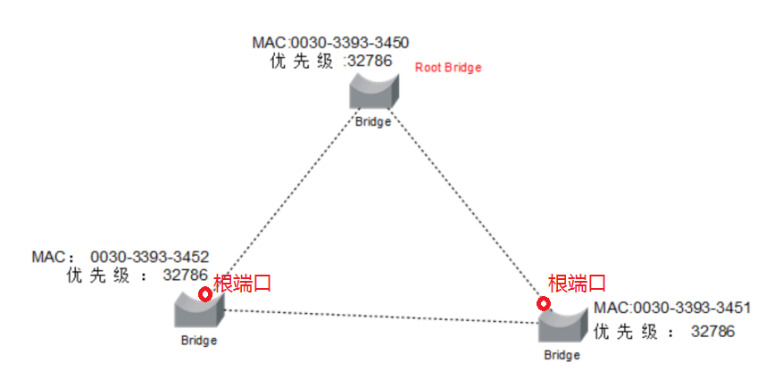
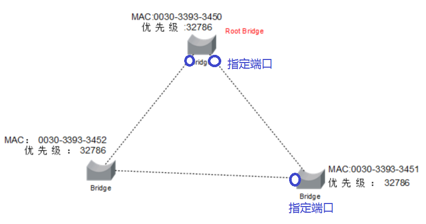
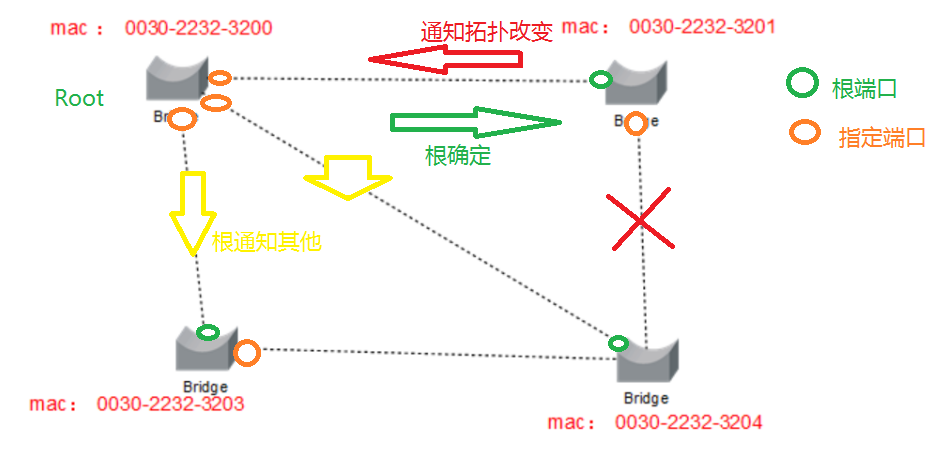
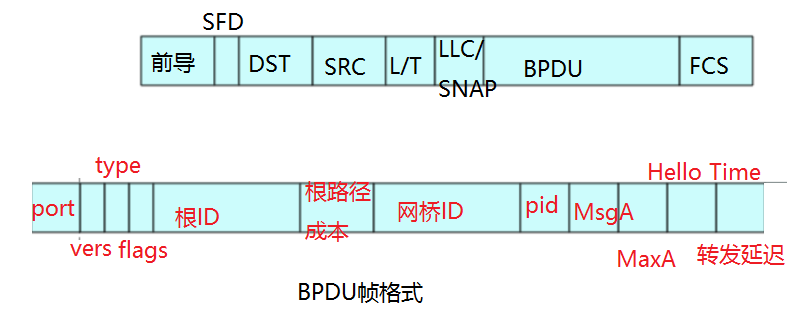
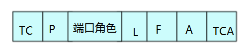

# Bridge and Switch

**1.网桥与交换机**
 	
>网桥也叫桥接器，是连接两个局域网的一种存储/转发设备，它能将一个大的LAN分割为多个网段，或将两个以上的LAN互联为一个逻辑LAN，使LAN上的所有用户都可访问服务器。

>交换机:高性能的网桥

>过滤数据库:每个网桥经过一段时间对外的mac地址学习后，知道每个站点可由哪个最佳端口发送,而存储的一张表

>有效期:过滤数据库的每条记录都有一个有效期,若在有效期内,没有此条记录的数据流,就会删除

**2.网桥端口状态**

```
Blocking（阻塞状态）：二层端口为非指定端口，也不会参与数据帧的转发。
Listening（侦听状态）：生成树会根据交换机所接收到的BPDU而判断出了这个端口应该参与数据帧的转发。
Learning(学习状态)：这个二层端口准备参与数据帧的转发，并开始填写MAC表。在默认情况下，端口会在这种
状态下停留15秒钟时间。
Forwarding（转发状态）：这个二层端口已经成为了活动拓扑的一个组成部分，它会转发数据帧，并同时收发
BPDU。
Disabled（禁用状态）：这个二层端口不会参与生成树，也不会转发数据帧。
```



**3.端口角色**

根网桥：选择根网桥的依据是网桥ID，网桥ID由网桥优先级和网桥MAC地址组成。网桥的默认优先级是32768。网桥ID值小的为根网桥，当优先级相同时，MAC地址小的为根网桥。



根端口：每个非根交换机选择一个根端口。选择顺序为：到根网桥最低的根路径成本→发送BPDU的网桥ID较小→端口ID较小的。端口ID由端口优先级与端口编号组成。默认的端口优先级为128。



指定端口：每个网段上选择一个指定端口。选择顺序为：根路径成本较低→发送BPDU的交换机的网桥ID值较小→本端口的ID值较小。另外，根网桥的接口皆为指定端口，因为根网桥上端口的根路径成本为0。



**4.生成树协议**

>STP(Spanning Tree Protocol):该协议可应用于网络建立树形拓扑结构,避免产生广播风暴,（1）选择根网桥（2）选择根端口（3）选择指定端口

>RSTP(Rapid Spanning Tree Protocol)：快速生成树协议,区别在于故障时立即发送一个拓扑改变通知,无需等待拓扑改变传递到根网桥



**5.BPDU(Bridge Protocol Data Unit,网桥协议数据单元)**



```
(1)LLC/SNAP(3 byte):固定值为0x424203
(2)Port(2 byte)：协议号0表示STP,2表示RSTP
(3)Type(1 byte):与port类似
(4)Flags(1 byte):
```



```
(5)根ID:根网桥优先级与mac地址的结合
(6)PID:优先发送的端口号(指定端口)
(7)MsgA:消息有效期,当根网桥发送一个BPDU时，他将此字段设置为0，以后非根网桥在此字段加1，用于记录经过网桥的数量
(8)MaxA:最大有效期,判断拓扑是否改变
(9)Hello Time:指出配置帧的传输周期
(10)转发延迟:指出处于学习和侦听状态的时间 
```
