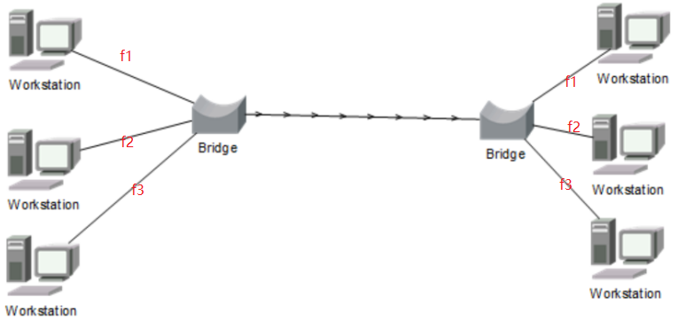
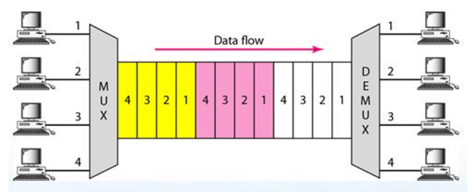
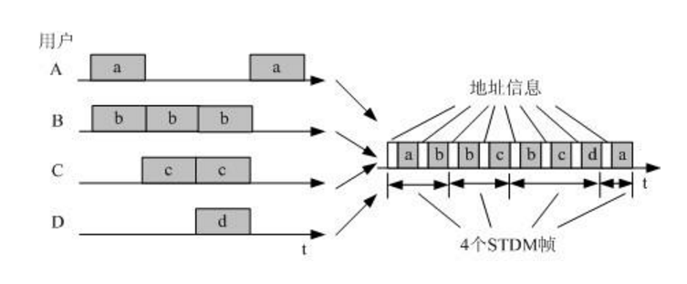
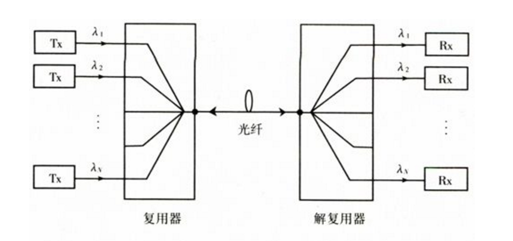
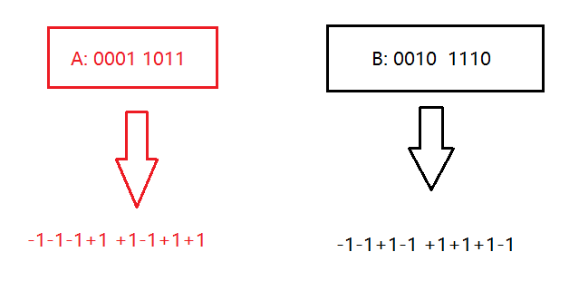
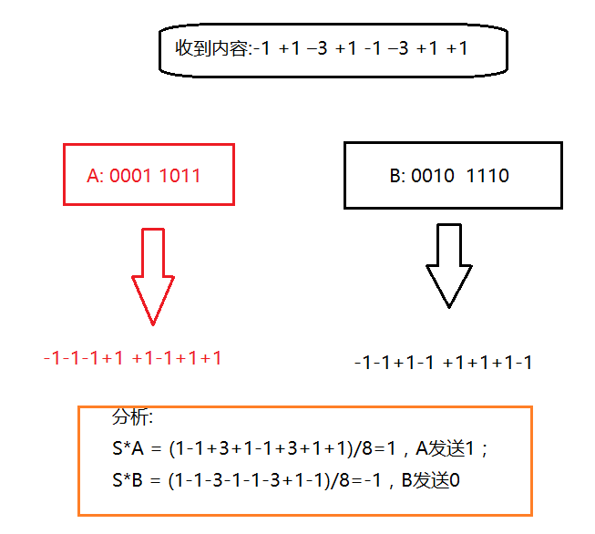

#Channel multiplexing technology

1.**频分复用(FDM)**：每个用户都分配有自己的频带，通信过程中至始至终都占用这个频带。频分复用的用户在同样的时间占用不同的频带宽度。

2.**时分复用(TDM)**：将提供给整个信道传输信息的时间划分为若干个时分复用帧(TDM),每一个用户在每一个TDM帧中占用固定序号的时隙进行数据传输。时分复用的所有用户在不同的时间占用相同的频带宽度。时分复用时固定分配时隙，往往会降低线路利用率

3.**统计时分复用(STDM)**：时分复用的改进。利用集中器对各个用户的数据进行缓存和按需动态分配时隙，然后发送出去。此种方法可以明显提高线路的利用率。

4.**波分复用(WDM)**：相当于光的频分复用，按波长来分配给用户

 	
5.**码分多址(CDMA)**：
a.使用CDMA的每一个站被指派一个唯一的m bit码片序列，一个站如果要发送比特1，则发送它自己的m bit码片序列，如果要发送0，则发送该码片序列的二进制反码，按照惯例将码片中的0写成-1，将1写成+1;
b. CDMA给每一个站分配的码片序列不仅必须各不相同，并且还必须互相正交，用数学公式表示，令向量S表示站S的码片向量，再令T表示其他任何站的码片向量。两个不同站的码片序列正交，就是向量S和T的规格化内积都是0：S* T = 0

