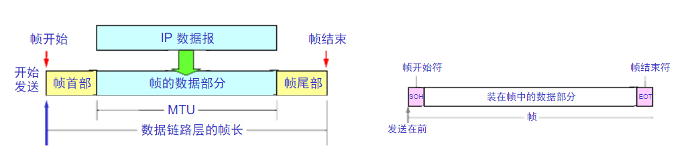
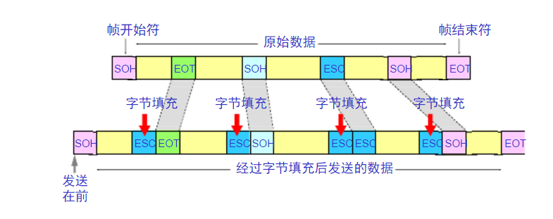

#Data Link Layer

**1.数据链路层使用的信道**：点对点信道和广播信道

>点对点是一对通讯设备在同一信道 上的向对方发送讯息，而广播信道是一套专用设备对许多在同一信道上的设备进行广播；也就是说是一对一和一对多的关系。

**2.数据链路和帧**:

(1)链路(物理链路)：一个结点到相邻结点的一段物理线路，中间没有任何转换结点。
(2)数据链路(逻辑链路)：由物理链路加上必要的通信协议构成。通常采用网络适配器来实现。
(3)帧：点对点信道的数据链路层的协议数据单元。

**3.数据链路层的三大基本功能**

3.1 ==封装成帧==：在一端数据的首部和尾部分别加上帧开始符(SOH 01)和帧结束符(EOT 04)。另外：数据长度应当小于数据链路层协议规定的最大传输单元(MTU)。

3.2 ==透明传输==：SOH和EOT都是二进制码，若帧中数据中出现了和SOH和EOT一样的二进制码，则会出现帧定界错误。为了解决这样的问题，可以在数据中出现控制字符SOH和EOT的前面加上转义字符ESC来避免上述错误(称为”字符填充法”)。

3.3 ==差错检测==：
(1)循环冗余检验(CRC)：在数据后面添加供差错检测用的n位冗余码，在接收端通过冗余码来进行差错检测。
(2)CRC差错检测技术只能保证每一帧的无差错接收(比特差错)，但并不能解决帧丢失，帧重复以及帧失序等问题。

**4.CSMA/CD协议(半双工通信)**：载波监听多点接入/碰撞检测(Carrier Sence Multiple Access with Collision Detection)
(1)==多点接入==：总线型网络
(2)==载波监听==：发送前先监听，如果其他站在发送数据则暂时不发送
(3)==碰撞检测==：边发送边监听，发送数据的同时检测总线信号电压来判断其他站是否在发送数据。档一个站检测到总线上的信号电压超过一定的阈值(超过阈值传输的信号会发生明显的失真)时，既表示总线上至少有两个站在发送数据，碰撞产生，适配器立刻停止发送。

**5.CSMA/CA(Carrier Sense Multiple Access with Collision Avoidance)载波侦听多路访问／冲突避免**:
（1）首先检测信道是否有使用，如果检测出信道空闲，则等待一段随机时间后，才送出数据。
（2）接收端如果正确收到此帧，则经过一段时间间隔后，向发送端发送确认帧ACK。
（3）发送端收到ACK帧，确定数据正确传输，在经历一段时间间隔后，会出现一段空闲时间。

**6链路聚合**

 链路聚合是将两个或更多数据信道结合成一个单个的信道，该信道以一个单个的更高带宽的逻辑链路出现
LACP(Link Aggregation Control Protocol,链路聚合控制协议)是一种实现链路动态汇聚的协议。LACP协议通过LACPDU（Link Aggregation Control Protocol Data Unit，链路聚合控制协议数据单元）与对端交互信息。
