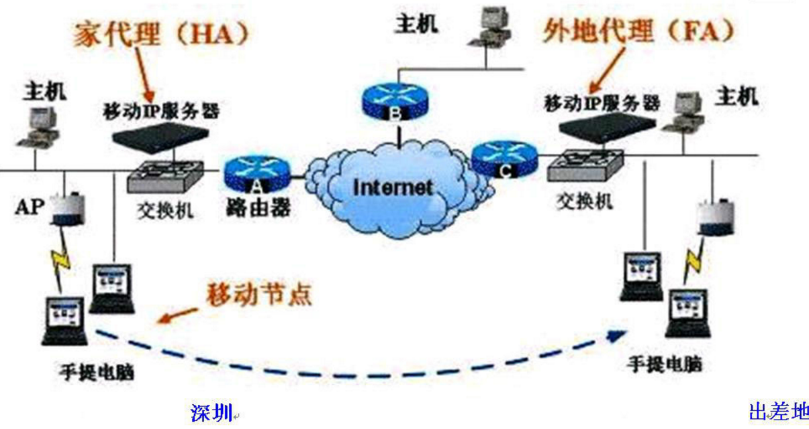

# Mobile IP


**1.简介**
>移动IP技术是移动节点(计算机/服务器/网段等)以固定的网络IP地址，实现跨越不同网段的漫游功能，并保证了基于网络IP的网络权限在漫游过程中不发生任何改变。移动IP即Mobile IP是为了满足移动节点在移动中保持其连接性而设计的。



**2.工作原理**

(1)几个基本概念
　　	
①移动节点：可从一条链路切换到另一条链路上，而仍然保持所有正在进行的通信，并且只使用它的家乡地址的那些节点。
②家乡代理：即本地代理，有一个端口与移动节点家乡链路相连的路由器。
③外地代理：在移动节点的外地链路上的路由器。
④隧道：当一个数据包被封装在另一个数据包的净荷中进行传送时所经过的路径。家乡代理为将数据包传送给移动节点，需先把数据包通过隧道送往外地代理。
⑤转交地址：家乡代理和移动节点的隧道出口。有两种转交地址。

	外地代理转交地址：即外地代理的IP地址，有一个端口连接移动节点所在的外地链路。外地代理转交地址的网络前缀并不一定与外地链路的网络前缀相同。
	
	配置转交地址：即暂时分配给移动节点的某个端口IP地址，其网络前缀必须与移动节点当前所连的外地链路的网络前缀相同。

(2)移动IP的工作过程
　　
　　①家乡代理和外地代理周期性发布代理广播消息，链路上的主机通过接收这个信息判断自己是处在家乡链路还是外地链路上。同时，连在外地链路上的移动节点从代理广播消息中得到转交地址。
　　②处于外地链路的移动节点向家乡代理注册转交地址。
　　③家乡代理和其他路由器广播对移动节点家乡地址的可达性，接收发往移动节点家乡地址包。
　　④家乡代理截取发往移动节点家乡地址的包，并通过隧道送往它的转交地址，外地代理从隧道中取出原始数据包，并通过外地链路送往移动节点。


**3.移动IP面临的安全威胁及对策**

>移动IP是工作在网络层的协议，它所引入的新的控制消息，如代理通告、注册请求和应答、绑定更新和代理发现等如果处理不当，容易受到攻击。此外，移动IP虽然可以工作在任何种类的链路上，但是在大多数情况下，移动IP应用于无线网络环境中，也就是通过无线链路接入网络，无线网络的特殊性使得同样的攻击在无线网络中更容易实施。再者，移动IP中的移动节点常常离开家乡网络，在不同的外地网络之间漫游，由于无法保证所有的外地网络都是可信的，因此移动节点很容易遭受被动窃听、会话窃取和各种主动攻击。

```
（1）．拒绝服务攻击
	在移动IP协议中，注册的一个首要目的是让移动节点将其转交地址通知其家乡代理，家乡代理将接收那
些目的地址为移动节点家乡地址的IP分组，并通过隧道发送到移动节点的转交地址。攻击者可以发出一个伪造的注
册请求消息给家乡代理，以其IP地址或一个欺骗IP地址代替移动节点的转交地址。这样，通信对端发出的所有IP分
组都会被移动节点的家乡代理通过隧道发送至攻击者指定的IP地址，而不是移动节点的转交地址。
	同样，攻击者可以通过假冒外地代理对移动节点发起拒绝服务攻击。
	为了防御这种移动IP的拒绝服务攻击，可以对移动节点和家乡代理之间的注册消息进行认证。为此，移
动IP协议提供了一些认证机制：通过认证扩展的方式提供了移动节点和移动代理之间的注册消息的认证，即移动一
家乡认证扩展，移动一外地认证扩展，外地一家乡认证扩展。其中，移动一家乡认证扩展是必选的，其余两个是可
选的。移动IP协议使用的默认认证算法是HMAC—MD5，采用前缀加后缀的模式。
```
　
```
（2）．中间人攻击　　
	中间人攻击是指攻击者拦截网络中的分组，经过修改之后再送回到网络中。在移动IP的代理发现机制中，移动节点可能会遭受中间人攻击。
	在移动IP中，移动代理周期性地发送代理通告消息，移动节点根据收到的代理通告消息来判断自己的位
置，判断是在家乡链路还是在外地链路。代理通告消息是作为ICMP路由器发现消息的移动扩展发送的。其中包含一
个序列号，移动节点根据该序列号判断外地代理是否重启，也就是说外地代理不再知道该移动节点的存在，需要重
新注册。攻击者可以利用这种机制，伪造一个代理通告消息，使得收到这个消息的移动节点认为需要重新注册。
	代理通告消息的发送方式可以是广播、多播和单播。由于广播和多播只能在当前链路上发送和接收，因
此，当攻击者位于移动节点所在链路以外的其他链路上时，这种攻击是无效的。而当移动节点发送代理请求消息
时，由移动代理响应的代理通告是以单播形式发送给移动节点的。这时，如果攻击者伪造一个单播的代理通告地址
给移动节点，就有可能成功。因此，移动节点应该抛弃那些单播的代理通告消息，除非它发送了代理请求消息。
```

```
（3）．重放攻击
	重放攻击是指攻击者截获数据，等待一段时间后重新发送，一般表现为对认证系统的攻击。攻击者记录
下任何保持不变的认证信息	，比如密码，然后重放以前发送过的合法消息，以此来骗过认证系统。
	在移动IP的注册过程中存在遭受重发攻击的隐患。一个攻击者可以将一个有效的注册请求信息保存起
来，然后经过一段时间后再重放这个消息，从而注册一个伪造的转交地址。为防止这种重放攻击，移动节点为每一
个连续的注册消息标识(identification)字段产生一个唯一值。该值使得家乡代理可以知道下一个值应该是多
少。这样，攻击者就无能为力了，因为它保存的注册请求信息会被家乡代理判定为已经过时了。
```