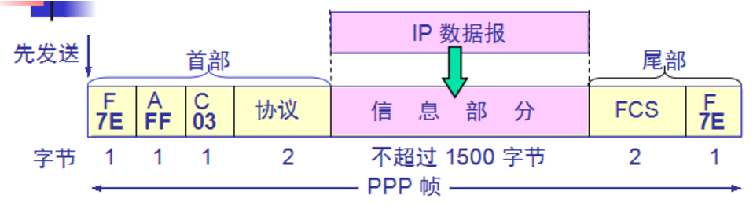
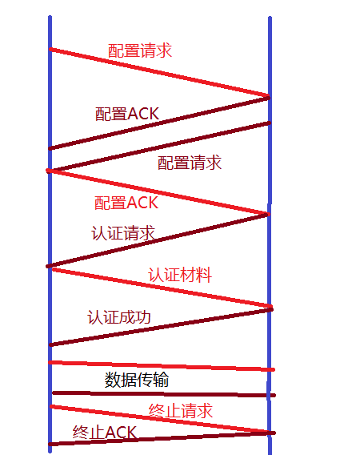

# Point to Point Protocol


**1.点对点协议帧格式**


(1) 标志：首部的标志符表示一个帧的开始或尾部的标志结束。规定为0x7E。
(2) 地址：因为是点对点，地址没有用，所以设为广播地址，0xFF
(3) 控制：规定为0x03，为保留字段，无意义
(4) 协议：定义数据字段中携带的数据类型（IP数据报->0x0021,LCP->0xC021,NCP->0x8021）
(5) 数据：长度可变，最大不超过1500字节
(6) 校验：FCS
```
字节填充：异步传输时转义字符为0x7D。填充方法：0x7E转变成(0x7D,0x5E),0x7D转变成(0x7D,0x5D)，
ASCII码的控制字符，即小于0x20的字符，如0x03变成(0x7D,0x23)。
零比特填充：同步传输，填充方式：发送端，当数据部分出现5个连续的1时，在后面添加一个0比特位，接受
端，当识别开始标志后，当出现5个连续的1时，去除后面的0比特位。
```
<br/>

**2.PPP(Point to Point Protocol)**

>在点对点连接传输多协议数据包提供一个标准方法，它是一个协议集合，是一种在串行链路上传输的IP数据包流行方法，被DSL大量广泛使用

LCP:建立,维护链路连接
NCP:网络状态会话
CCP:数据帧压缩
PAP，CHAP：用于认证

a).LCP（Link Control Protocol），在PPP通信中，发送端和接收端通过发送LCP包来确定那些在数据传输中的必要信息。用于建立,维护链路连接



b).NCP(Network Control Protocol)，即网络控制协议，在LCP完成链路建立和认证之后，该链路每端都进入网络状态，并使用一个或多个NCP进行网络层相关协商

c).CCP(Compress Control Protocol,压缩控制协议)在链路进入网络状态协商，用于压缩

d).PAP(Password Authentication Protocol，密码认证协议),用于控制认证，这种协议非常简单，一方请求，另一方发送一个密码，由于密码在PPP链路上加密传输，窃听者易捕获

e).CHAP(Challenge Handshake Authentication Protocol，查询-握手认证协议):安全性更高

<br/>

**3.PPP协议的应用**

>PPP协议是目前广域网上应用最广泛的协议之一，它的优点在于简单、具备用户验证能力、可以解决IP分配等。

```
家庭拨号上网就是通过PPP在用户端和运营商的接入服务器之间建立通信链路。 目前，宽带接入正在成为取
代拨号上网的趋势，在宽带接入技术日新月异的今天，PPP也衍生出新的应用。典型的应用是在ADSL（非对称
数据用户环线，Asymmetrical Digital Subscriber Loop）接入方式当中，PPP与其他的协议共同派生出
了符合宽带接入要求的新的协议，如PPPoE（PPP over Ethernet），PPPoA（PPP over ATM）。利用以太
网（Ethernet）资源，在以太网上运行PPP来进行用户认证接入的方式称为PPPoE。PPPoE即保护了用户方的
以太网资源，又完成了ADSL的接入要求，是目前ADSL接入方式中应用最广泛的技术标准。同样，在ATM（异
步传输模式，Asynchronous Transfer Mode）网络上运行PPP协议来管理用户认证的方式称为PPPoA。它与
PPPoE的原理相同，作用相同；不同的是它是在ATM网络上，而PPPoE是在以太网网络上运行，所以要分别适
应ATM标准和以太网标准。
```
