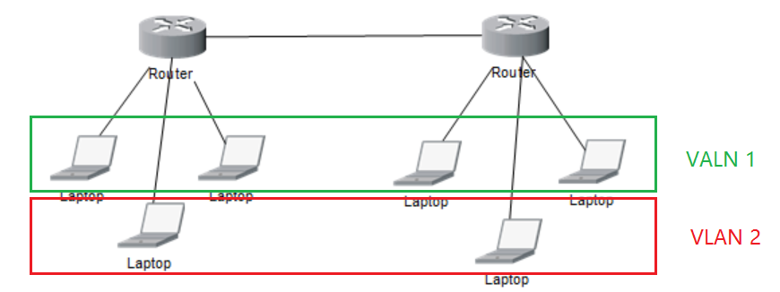
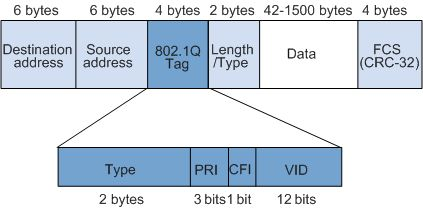

# VLAN


>VLAN(Virtual Local Area Network):是一组逻辑上的设备和用户，这些设备和用户并不受物理位置的限制，可以根据功能、部门及应用等因素将它们组织起来，相互之间的通信就好像它们在同一网段一样,

	


**帧格式**



>在交换机（路由器）之间传输的特殊帧格式，

```
VLAN标记

Type（2字节）：802.1q标记类型（0x8100）
PRI（3位）：用户优先度
CFI（1位）:规范格式指示符
VID（12位）：唯一标识这个以太网帧属于哪一个VLAN
```
