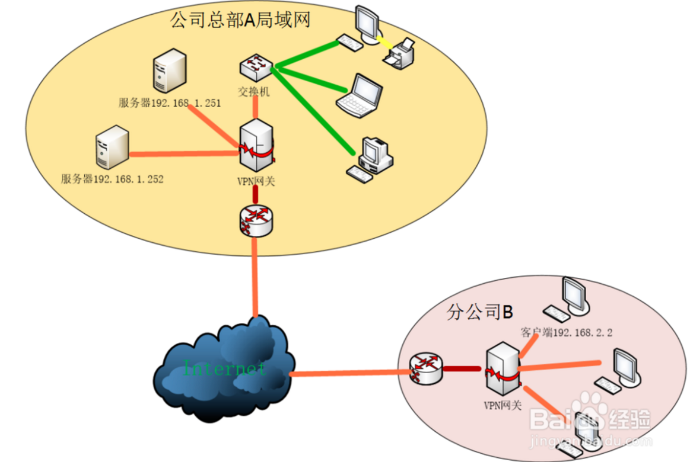
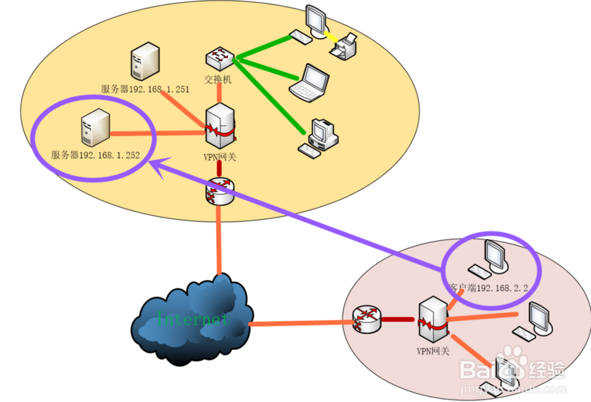
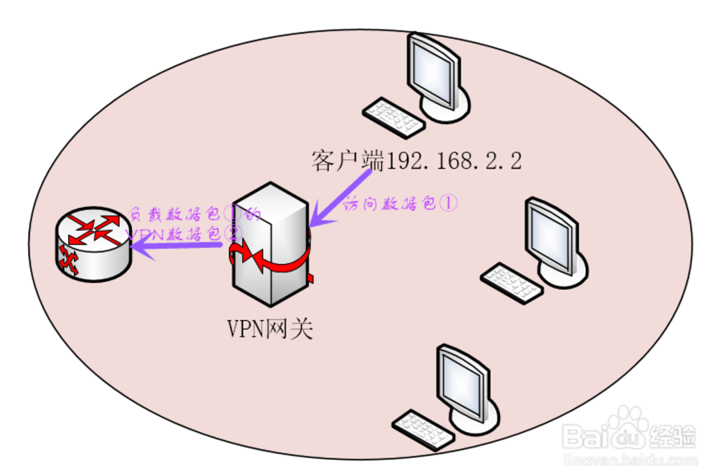
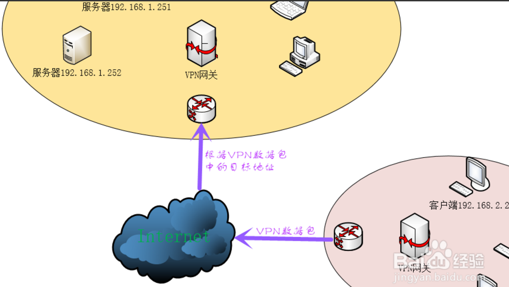
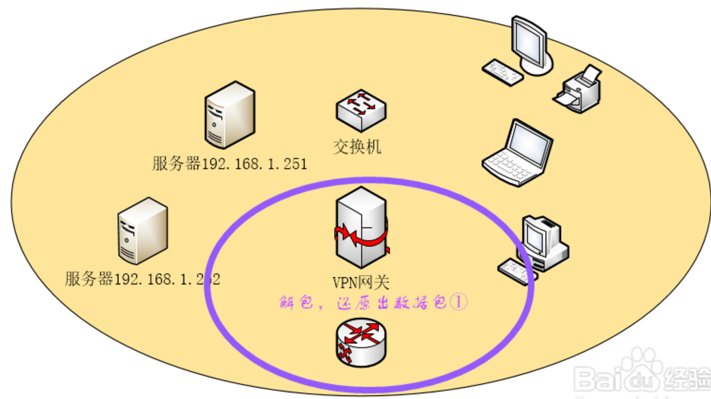
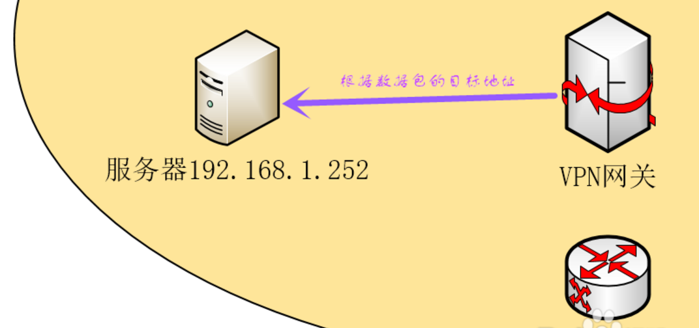
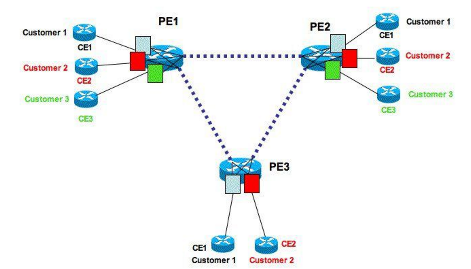

#VPN

**1.虚拟专用网络(Virtual Private Network)**的功能是：在公用网络上建立专用网络，进行加密通讯。在企业网络中有广泛应用。VPN网关通过对数据包的加密和数据包目标地址的转换实现远程访问。

**2.工作原理**

（1）分公司B的终端（192.168.2.2）需要访问总部A的服务器（192.168.1.252），其发出的访问数据包的目标地址为服务器的IP：192.168.1.252。

（2）分公司B局域网的VPN网关在接收到终端（192.168.2.2）发出的访问数据包①时对其目标地址（192.168.1.252）进行检查，发现目标地址属于公司总部A网络的地址，于是将该数据包①根据所采用的VPN技术进行封装，同时VPN网关会构造一个新的VPN数据包②，并将封装后的原数据包①作为VPN数据包②的负载，VPN数据包的目标地址为公司总部A网络的VPN网关的公共IP地址。

（3）分公司B局域网的VPN网关将VPN数据包发送到Internet外网中，由于VPN数据包的目标地址是总部A网络的VPN网关的外部地址，所以该数据包将被Internet中的路由正确地发送到总部A网络的VPN网关；

（4）总部A网络的VPN网关对接收到的数据包②进行检查，如果发现该数据包是从分公司B网络的VPN网关发出的，即可判定该数据包为VPN数据包，并对该数据包进行解包。解包的过程主要是将VPN数据包的包头剥离，将负载通VPN技术反向处理还原成原始的数据包①；  

（5）总部A网络的VPN网关将还原后的原始数据包发送至目标服务器（192.168.1.252）。在服务器（192.168.1.252）看来，它收到的数据包就跟从终端（192.168.2.2）直接发过来的一样。  

**3.常用VPN技术**
  
（1）．MPLS VPN是一种基于MPLS技术的IP VPN，是在网络路由和交换设备上应用MPLS（Multiprotocol Label Switching，多协议标记交换）技术，简化核心路由器的路由选择方式，利用结合传统路由技术的标记交换实现的IP虚拟专用网络（IP VPN）。MPLS优势在于将二层交换和三层路由技术结合起来，在解决VPN、服务分类和流量工程这些IP网络的重大问题时具有很优异的表现。因此，MPLS VPN在解决企业互连、提供各种新业务方面也越来越被运营商看好，成为在IP网络运营商提供增值业务的重要手段。MPLS VPN又可分为二层MPLS VPN（即MPLS L2 VPN）和三层MPLS VPN（即MPLS L3 VPN）。

MPLS VPN网络主要由CE、PE和P等3部分组成：

CE(Customer Edge Router)用户网络边缘路由器设备，直接与服务提供商网络相连，它“感知”不到VPN的存在；

PE(Provider Edge Router)服务提供商边缘路由器设备，与用户的CE直接相连，负责VPN业务接入，处理VPN-IPv4路由，是MPLS三层VPN的主要实现者；

P(Provider Router)服务提供商核心路由器设备，负责快速转发数据，不与CE直接相连。

在整个MPLS VPN中，P、PE设备需要支持MPLS的基本功能，CE设备不必支持MPLS。

虚拟路由转发VRF--virtual routing forwarding
    VRF是一种VPN路由和转发的实例.每一个独立的VRF都有一张独立的路由表。这个概念很重要。因为在PE路由器上的路由需要被相互隔离，以确保对每一个用户VPN的私有性，所以每一个VPN都应该有自己的路由表。这张私有路由表就被称为VRF路由表。

RD---route distinguish 路由区分 
有两家公司，公司A和公司B，大家的私网地址都是192.168.0.0/16,那么这个时候，两个公司的路由都送到了PE路由器上，PE路由器怎么知道公司A的192.168.0.1到10.1.1.1应该往VRF A去送，而公司B的192.168.0.1应该送往VRF B呢？

（2）．SSL VPN是以HTTPS（Secure HTTP，安全的HTTP，即支持SSL的HTTP协议）为基础的VPN技术，工作在传输层和应用层之间。SSL VPN充分利用了SSL协议提供的基于证书的身份认证、数据加密和消息完整性验证机制，可以为应用层之间的通信建立安全连接。SSL VPN广泛应用于基于Web的远程安全接入，为用户远程访问公司内部网络提供了安全保证。

（3）．IPSec VPN是基于IPSec协议的VPN技术，由IPSec协议提供隧道安全保障。IPSec是一种由IETF设计的端到端的确保基于IP通讯的数据安全性的机制。它为Internet上传输的数据提供了高质量的、可互操作的、基于密码学的安全保证。

4.网警追踪

(1).不用代理
网民发帖流程：
发帖人　→　ISP　→　服务器托管商　→　服务器
网警追踪流程：
网监　→　服务器IP　→　发帖人IP　→　发帖人ISP　→　档案
爆菊几率：100%

(2).只用1层私人VPN
网民发帖流程：
发帖人　→　ISP　→　VPN　→　服务器托管商　→　服务器
网警追踪流程：
网监　→　服务器IP　→　VPN的IP　→　路由日志　→　链接者IP　→　链接者ISP　→　办网档案
爆菊几率：100%
(3).用1层共用VPN
网民发帖流程：
发帖人　→　ISP　→　VPN　→　服务器托管商　→　服务器
网警追踪流程：
网监　→　服务器IP　→　VPN的IP　→　**VPN服务器　→　日志　→　链接者IP　→　链接者ISP　→　办网档案
爆菊几率：80%
