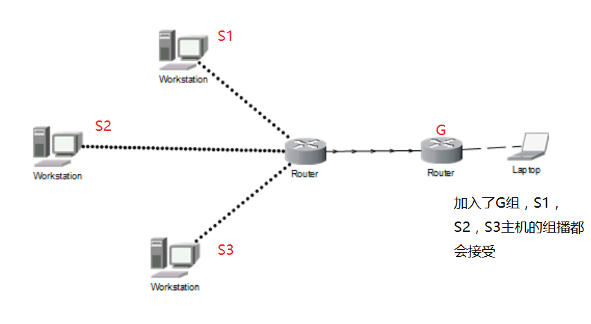
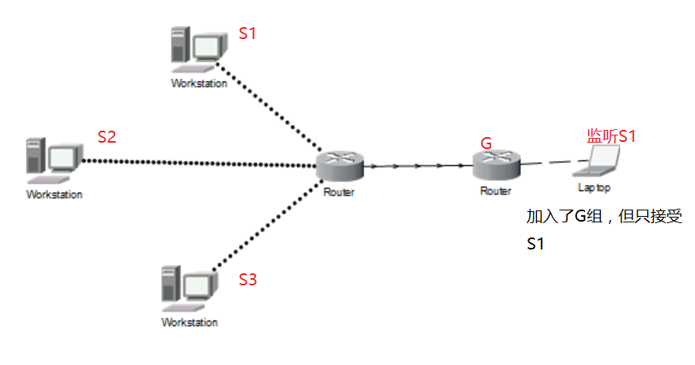

# IGMP

**1.广播**

>一般来说，只有UDP传输协议用户应用程序利用广播与组播，而TCP只能用于单播

>广播:路由简单地将它接受到的任意报文副本转发除报文到达接口以外的其他接口，在ipv4中通过将主机部分全部设置为1

 

**2.组播**

组播(IGMP,Internet Group Management Protocol):让连接在本地局域网上的多播路由器知道本局域网上是否有主机参加或退出某个多播组

多播路由选择协议:找出以源主机为根节点的多播转发树，与其他多播路由器协同工作，以便把多播数据报以最小代价传递给所有组员

组播方式：

ASM(任意源组播):每个站选择愿意接受流量的组地址，而不考虑发送方

SSM(特定源组播):允许端终明确包含或排除从一组特定的发送方发送到一个组播组的流量

