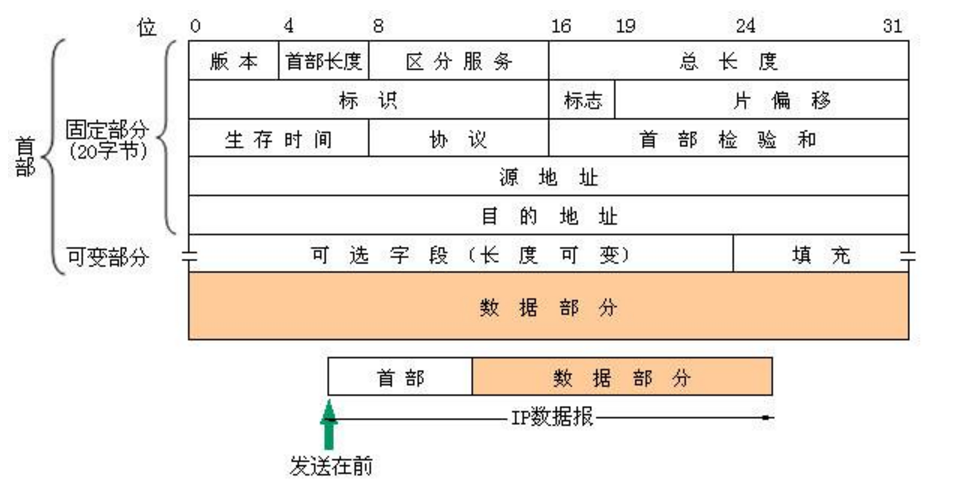

# Internet Protocol

**1.IP协议:**

IP地址=网络号net_id+主机号host_id，用点分十进制(每八位转换成十进制)表示。

**2.IP分类**
```
 (1)A类：1字节网络号+3字节主机号，网络号最高为为0，地址范围：1.0.0.0～126.255.255.255，最大主
机数为2 ^24-2=16777214个。
 (2)B类：2字节网络号+2字节主机号，网络号前两位为10，地址范围：128.1.0.0~191.255.255.255，最大
主机数为2 ^16-2=65534个
 (3)C类：3字节网络号+1字节主机号，网络号前三位为110，地址范围：192.0.1.0～223.255.255.255，最
大主机数为2 ^8-2=254个
 (4)D类：多播地址，1110开始
 (5)E类：保留地址，1111开始
```


**3. IP数据报的格式**



```
(1) 版本号：IP协议的版本
(2) 首部长度：常用首部长度为20个字节
(3) 区分服务：一般不使用这个字段
(4) 数据报总长度：首部和数据之和，占16位，表示最大长度为65535字节,由于MTU限制，一般不超过1500
字节。另外数据报的总长度不是指未分片前的数据报总长度，而是指分片后的每一片的首部+数据的长度
(5) 标识：标识字段由计数器产生，每产生一个数据报就加1，数据报分片后标识段也被复制到各个分片中，
以便重装成原来的数据报。
(6) 标志：三位，最低位记为MF，MF=1代表还有分片，反之则没有；中间一位记为DF，DF=1代表不允许分
片，反之则允许分片
(7) 片偏移：分片后的该片在原分组中的相对位置。单位为8个字节，分片的长度都是8自己的倍数；
(9) 生存时间(TTL)：数据报在网络中的寿命。防止无法交付的数据报无限制地在网络中兜圈子。每经过一个
路由器，TTL就减去数据报在该路由器中消耗的时间，TTL为0就丢弃该报。
(10) 协议：指携带的数据时何种协议。常用协议字段：1-ICMP，2-IGMP，6-TCP，8-EGP，17-UDP，41-
IPv6等等
(11) 首部检验和：IP校验和只校验IP首部，不包含数据
(12)源地址和目的地址：每个占32位，IP地址。
```