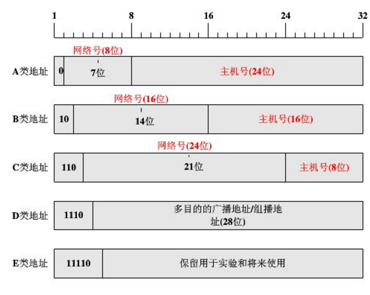

# Network Layer


**1.网络层**

网络层向上只提供简单灵活的，无连接的，尽最大努力交付的数据报服务

<br/>

**2.IP地址的编址**

(a).分类的IP地址

```
(1)A类：1字节网络号+3字节主机号，网络号前一位为0，地址范围：1.0.0.0～126.255.255.255，最大主
机数为2 ^24-2=16777214个。
(2)B类：2字节网络号+2字节主机号，网络号前两位为10，地址范围：128.1.0.0~191.255.255.255，最大
主机数为2 ^16-2=65534个
(3)C类：3字节网络号+1字节主机号，网络号前三位为110，地址范围：192.0.1.0～223.255.255.255，最
大主机数为2 ^8-2=254个
(4)D类：多播地址，1110开始
(5)E类：保留地址，1111开始
```




(b).划分子网

```
IP地址={<网络号>，<子网号>，<主机号>}，借用主机号的若干位作为子网号subnet_id，从两级IP结构变成了三级IP结构，划分子网纯属一个单位内部的事，对外仍表现为一个网络。
```


(c).无分类编址CIDR

```
(1) IP结构：IP地址 = {<网络前缀>，<主机号>}，采用斜线记法，128.13.35.7/20，表示前20位为网
络前缀
(2) 网络前缀相同的连续IP地址组成一个CIDR地址块
(3) 地址掩码：也可继续称为子网掩码。
(4) 查找路由表的时候，可能会得到不止一个匹配结果。应当从匹配结果中选择最长前缀匹配的路由
```

>例如：目的地址206.0.71.130和206.0.68.0/22以及206.0.71.126/25都可以匹配;这时就需要选择最长前缀匹配206.0.71.126/25作为下一跳地址。

<br>

**3.虚拟专用网**

```
在因特网中的所有目的路由器，对目的地址时专用地址的数据报一律不进行转发。如：
10.0.0.0/8到10.255.255.255
172.16.0.0/12到172.31.255.255
192.168.0.0/16到192.168.255.255
```