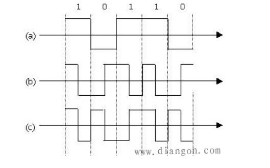

# Physical Layer

**1.传输媒体**

>(1)导向传输媒体：双绞线(STP屏蔽双绞线，UTP无屏蔽双绞线)，同轴电缆（有线），光缆（多模光纤：存在多条不同角度入射的光线传输，只适用于近距离传输；单模光纤：一根光线的传输，适合远距离传输，工艺复杂）

>(2)非导向传输媒体：无线电波通信（占主要地位），短波通信(电离层的反射，容易产生衰弱现象及多径效应)；除紫外线和更高的波段不能用于通信，其他都可以

<br/>

**2.通信系统**

>(1)源系统：包括源点和发送器，前者负责产生要传输的数据，后者负责对比特流数据进行编码后发送到传输线路上(调制器)。

>(2)传输系统：简单的传输线或者复杂的传输网络

>(3)目的系统：包括接收器和终点。前者负责接收传输来的数据并转换成能够被目的设备处理的信号，后者负责从接收器获取数据并把信息输出。

<br/>

**3.通信方式**

>(1)单向通信：单工通信，只能从一方发送另一方接受，没有反方向的交互（一条信道）

>(2)双向交替通信：半双工通信，双方都可以发送消息，但是不能同时发送（一条信道）

>(3)双向同时通信：全双工通信，双方可以同时发送和接受消息（二条信道）

<br/>

**4.调制**

(1)编码（数字信号-->数字信号）



```
a.不归零制：正电平代表1，负电平代表0，图a
b.归零制：正脉冲代表1，负脉冲代表0
c.曼彻斯特编码：位周期中心的向上跳变代表0，位周期中心的向下跳变代表1（也可以反过来），图b
d.差分曼彻斯特编码：在每一位的中心处始终都有跳变，位开始边界有跳变代表0，而位开始边界没有跳变代表1，图c
```

(2)带通调制方式（数字信号-->模拟信号）

```
调幅(AM)
调频(FM)
调相(PM)
```

<br/>

**5.奈氏准则**

```
码间串扰：接收端收到的信号波形失去码元之间的清晰界限
奈氏准则：在任何信道中，码元传输的速率是有上限的，传输速率超过此上限，就会出现严重的码间串扰的问题
信噪比: 10 log10(S/N)，信噪比越大越好
香农公式: C=W log2 (1+S/N)，信道的带宽或信道中的信噪比越大，信息的极限传输速率就越高
```
