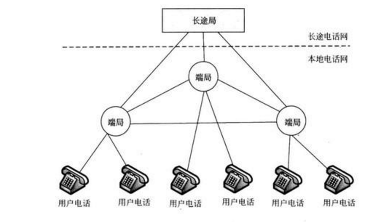
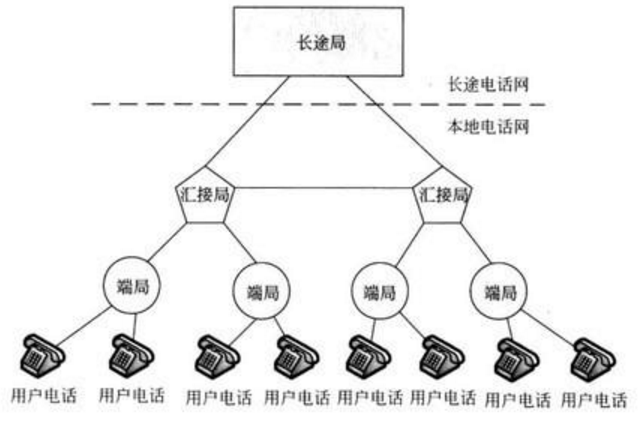
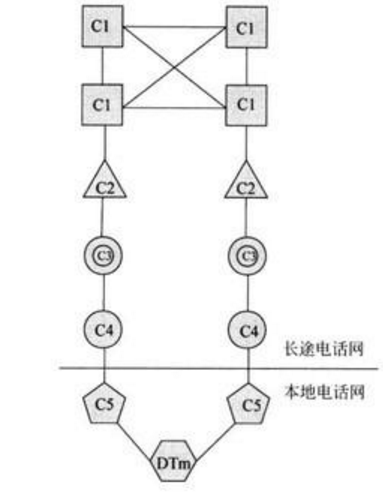

#PSTN
**1.简介**
>公共电话交换网(public switched telephone network，PSTN)：是提供电话服务的公共网络系统，是国家公用通信基础设施之一，由国家电信部门统一建设、管理和运营。它主要是提供语音通信服务，同时还提供数据通信业务，如电报、传真等。

**2.公用电话交换网的构成**
>公用电话交换网一般由本地电话网和长途电话网组成，其中长途电话网又包括国内长途电话网和国际长途电话网两部分。

（1）本地电话网
本地电话网是指一个城市或一个地区的电话网，它覆盖市内电话、市郊电话以及周围城镇和农村的电话用户，由端局和汇接局组成，端局主要与长途电话网进行交换任务，汇接局主要是进行本地区的电话交换，与端局构成一个同一长途区号的局部公共网络，图1所示为本地电话网网状网结构。

本地电话网采用网状网结构，其电话交换局之间通过中继线连接，由于中继线是公用的，因此线路利用率高，且通过线路的话务量也较大，提高了网络利用率，降低了线路成本。但当交换局数量较多时，网状网结构将导致电话交换局间中继线数量的急剧增加，带来不便，此时可以采用分区汇接制，把电话网分为若干个“汇聚区域”，在汇接区内设置汇接局，下设若干个端局，端局再通过汇接局汇集，构成二级本地电话网，

目前，我国本地电话网的类型主要包括京、津、沪、穗等城市本地电话网，大城市本地电话网，中等城市电话网，小城市本地电话网和县本地电话网5种类型。

（2）国内长途电话网
　　
国内长途电话网是指全国各城市间用户进行长途通话的电话网，它能够提供城市或省之间的电话业务，一般与本地电话网在固定的交换中心完成汇接。
我国长途电话网中的交换节点又可以分为省级交换中心和地(市)级交换中心两个等级，它们分别完成不同等级的汇接转换。

国际长途电话网
　　
国际长途电话网是指把世界各国的电话网相互连接起来，以提供国家之间电话业务的国际电话网。为此，每个国家都需要设置一个或几个国际电话局进行国际拨出和接入的连接。一个国际长途通话实际上是由发话国的国内网部分、发话国的国际局、国际电路和受话国的国际局以及受话国的国内网等几部分组成的。
最初，我国传统电话网是由四级长途交换中心和一级本地电话网端局组成的五级结构，如图3所示。其中一、二、三、四级的长途交换中心构成长途电话网，由本地电话网端局和按需要设置的汇接局组成本地电话网。

其中，C1为大区交换中心，C2为省交换中心，C3为地区交换中心，C4为县交换中心，C5为五级交换中心(本地电话网端局)。到1992年底我国共有8个C1(北京、天津、沈阳、上海、南京、广州、西安、成都)，3个国际局(北京、上海和广州)。在本地电话网中，一般设置汇接局(Digital Tandem，DTm)和端局(C5)两个等级，汇接局可分为市话汇接局、郊区汇接局、农话汇接局等。