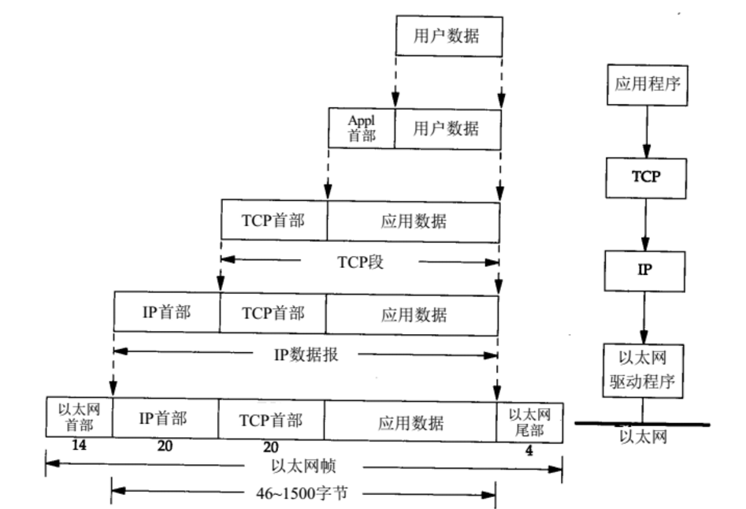
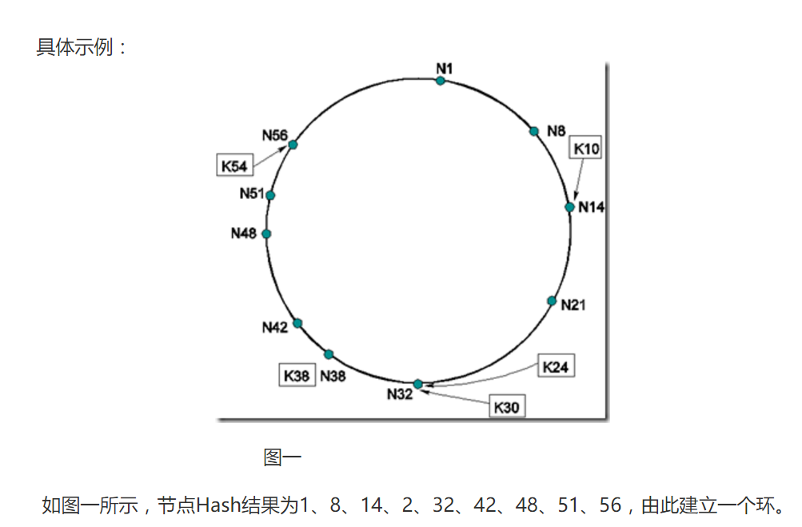
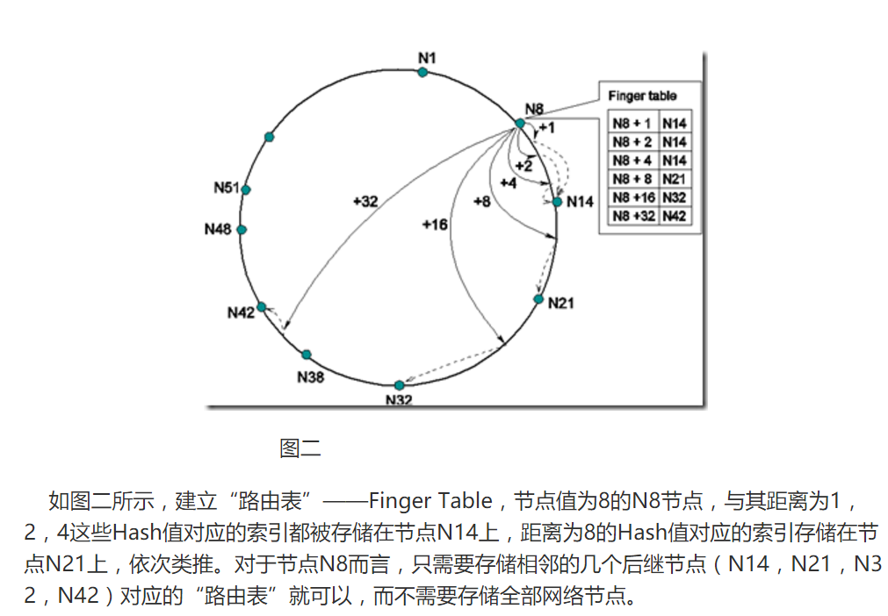
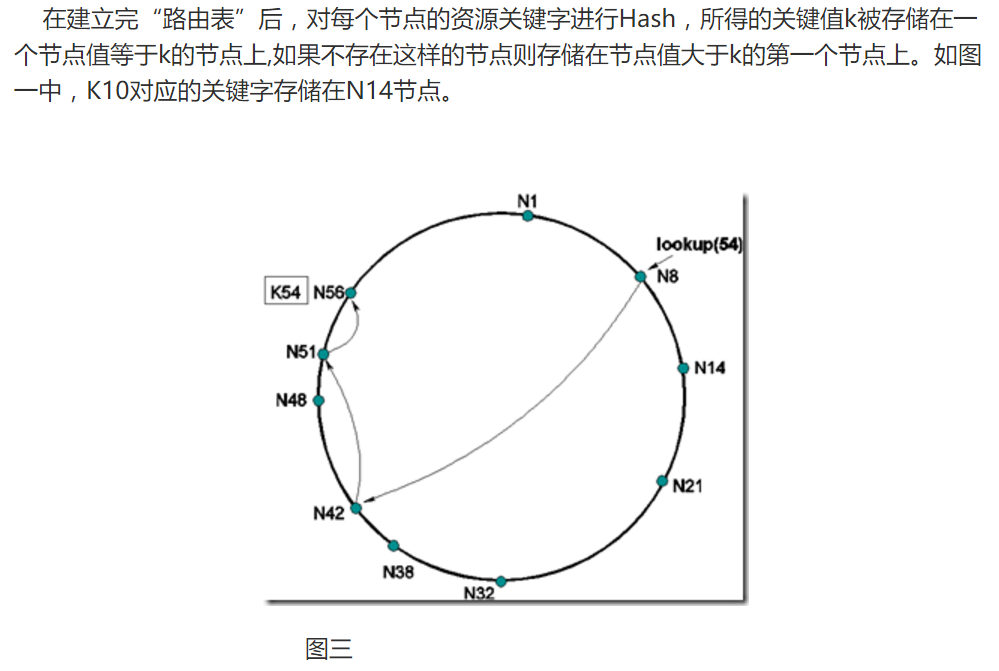
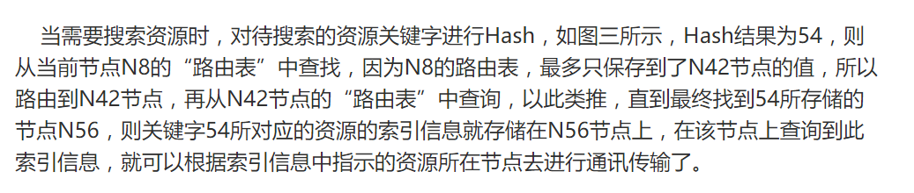
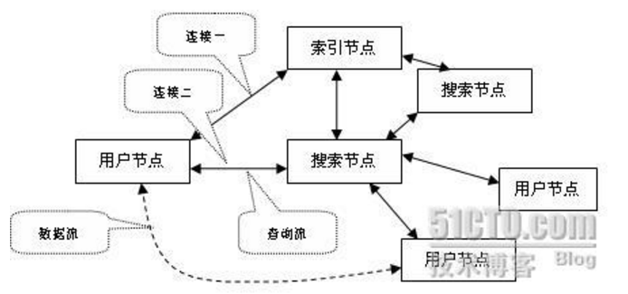

# Summary

**1.概念**

```
计算机网络（网络）:由若干结点和连接这些结点的链路组成
互连网：网络之间通过路由器互连起来构成一个覆盖范围更大的计算机网络
互联网：它是当前全球最大的，开放的，由众多网络相互连接而成的特定互连网，它采用TCP/IP协议族作为通信的规则，且其前身是美国的ARPANET
ISP(Internet Service Provider,互联网服务提供者)：进行商业活动的公司
信道：表示向某一个方向传送信息的媒体
体系结构：计算机网络及其构件所应完成的功能的精确定义
RFC(Request For Comments)就是tcp/ip协议的标准文档
```

**2.因特网的组成**

>边缘部分：由所有连接在因特网上的主机组成

>核心部分：由大量网络和连接这些网络的路由器组成

<br/>

**3.计算机之间的通信方式**

>客户服务器端方式（C/S模式）：客户端是服务请求方，服务器端是服务提供方。

>对等方式（P2P模式）：平等,对等连接通信，每一个主机既是客户又是服务器。

<br/>

**4.电路交换，分组交换和报文交换**

```
电路交换:
	即生活的打电话的时候，要想实现双方的通信，就需要建立连接，然后再进行通话，最后再挂断。
建立连接就是电路交换中占用通信资源的开始	，通话时期一直占用通信资源，就算双反不说话也会一直
占用，挂断就是释放资源的行为。所以，电路交换的整个过程即：建立连接(占用通信资源)->通话(一直占
用通信资源)->释放连接(归还通信资源)。由于在网络中，数据的发送与传输都是突发式的，所以电路交换
并不适用于计算机的数据传送。 
```	

```
报文交换:
	报文是指计算机要发送或接受的那一串数据。它采用的是存储转发技术，即在各个路由器之间存
储再转发，有点类似于寄信这种方式，把信件放到邮局，然后再传给下一个邮局，最后传到目的地。这种方
式更加适合于计算机的数据传输了，因为除了传输的时候会占用资源以外，平时都不会占用，即发即用。但
是传输的数据过大的话，会造成大量的时延，使得传输效率不尽人意。 
```

```	
分组交换:
	它是建立在报文交换基础上的一种改进，也是采用存储转发方式进行。报文交换存在的问题就是
传输的数据量过大会导致时延增加，并且对路由器和交换机的性能也有要求。分组交换就完美地解决了这个
问题，它把整个报文分成若干组进行存储转发。为了识别到底哪些分组才是一个整体的报文，在分组的同时
在数据段的前面加上了一些控制消息组成了首部，这样就是一个完整的分组了。
```

<br/>

**5.计算机网络的类别：**

>按作用范围分：广域网(WAN)，城域网(MAN)，局域网(LAN)，个人区域网(PAN)

>按使用者分：公用网(public network)，专用网(private network)

<br/>

**6.计算机网络的性能：**

>5.1 速率：信道上传送数据的速率。单位:b/s（bps）,还有kb/s(10^3),Mb/s(10^6),Gb/s(10^9)等，指的是额定速率或标称速率

>5.2 带宽：原指某个信号具有的频带宽度，在计算机网络中指单位时间内信道中的最高数据率。单位：b/s

>5.3 吞吐量：单位时间内通过某个网络(或信道，借口)的数据量。绝对上限值等于带宽。

>5.4 时延：数据从一端传送到另一端的所需的时间。( 总时延 = 发送时延 + 传播时延 + 处理时延 + 排队时延 )

>5.5 时延带宽积=传播时延 * 带宽

>5.6 往返时间RTT

>5.7 利用率（信道利用率：指出某信道有百分之几的时间是被利用的（有数据通过），完全空闲的信道的利用率为零。  网络利用率：全网络的信道利用率加权平均值）

<br/>

**7.封装**

>实际上数据是通过链路层传到其他网络的，那么数据从应用程序一直往下，通过4个层，每一层都给数据添加一些首部（尾部）信息。这就叫封装。下图为封装的过程： 


```
TCP传给IP的数据单元：TCP报文段（TCP segment）
UDP传给IP的数据单元：UDP数据报（UDP datagram）
IP传给网络接口层的数据单元：IP数据报（IP datagram）
以太网传输的比特流：帧（Frame），长度必须在46~1500字节之间。（涉及到MTU最大传输单位）
```

<br/>

**8.P2P**

>P2P(Peer to Peer)对等计算机或对等网络：P2P的核心是数据存储在客户本地，通过存储信息(名称、地址、分块)的查询，让终端之间直接数据传递。P2P网络让网络上的数据流量分散化，同时管理点不仅没有服务容量的压力，而且只存储数据的索引与链接，不对数据本身负责，避免了版权与管理的麻烦。自由、松散的P2P网络的最大问题是给政府的监管非常困难，面对的不是一个组织，而是每一个用户。一个用户加入P2P网络后，把自己计算机的处理能力、存储能力贡献给网络，具体谁在使用自己并不清楚。网络的设计者提供了一种集中大家资源的方式，也定义了规则，但具体的内容就要看具体的用户了。P2P是一种新技术，是一个与C/S、B/S并列的业务开发模式，技术是好的，但天生就是小人物反抗大公司的产物，所以有些人不太欢迎它。

<br/>

**9.P2P网络结构**

```
(1).集中式P2P网络：代表是Napster、QQ
	有一个中心服务器负责记录共享信息(索引信息)并应答对这些信息的查询。与C/S模式的差异是
在C/S结构中，客户端之间没有数据流，通过中心服务器交换数据。而P2P登录与信息查询都与中心服务器连
接，但查询到数据后，就与存放数据的客户端直接建立连接。
```

```
(2).分布式非结构化P2P网络：代表是Gnutella
	采用了随机图的组织方式来形成松散的网络，没有中心服务器，采用洪泛式搜索(Flooding)和
随机转发机制(TTL转发机制)，每个节点功能相同，兼作服务器和客户机。节点的管理有些象路由的管理，
信息在网络中象水的波纹一样传播，直到“能量”耗尽。
	在网络中，flooding是指从任何节点通过一个路由器发送的信息包会被发送给与该路由器相连的
所有其他节点（除了发送信息包出来的那个节点）。flooding是快速散布路由更新信息到整个大型网络的每
个节点的一种方法。
```
```
(3).分布式结构化P2P网络：代表Pastry、Tapestry、Chord、CAN
	结构化是对网络解决的管理方式，是一种逻辑上可以结构化查询，而不是物理连接的变动，结构
化是为了搜索算法的快捷，一般相当于折半查找。DHT(Distributed Hash Table分布式散列表)路由算法
是通过分布式散列函数将输入的关键字唯一映射到某个节点上，然后通过特定路由算法和该节点建立连接。
网络节点被分配唯一节点标识符(Node ID)，资源对象通过散列运算产生唯一资源标识符(Object ID)，且
该资源存储在NID与之相等或相近的节点上，查询时，同样的方法定位到存储该资源的节点。
```






```
(4)混合式(半分布式)P2P网络：第三代P2P，代表Skype
	在分布式模式基础上，将用户节点按能力进行分类，使某些节点担任特殊的任务。用户节点：可
以从索引节点处得到相临的搜索节点地址。搜索节点：处理搜索请求，要有128k以上的速度，从子节点中搜
索文件列表。索引节点：速度快、内存大的节点，保存可以利用的搜索节点信息、搜集状态信息，并维护网
络结构。索引节点也可以同时是搜索节点。用户节点可以选择三个搜索节点为父节点，并提交它的共享列
表。一个父节点可以维护500个孩子节点。
	首先索引节点的引入不直接连接有版权的资料，摆脱了版权问题。其次引入搜索节点，查询时，
用户节点直接连接搜索节点，若搜索的结果不足100个，就向相临的搜索节点再发请求，若还不足，再继续扩
散请求，直到所有的搜索节点都访问过。
```


