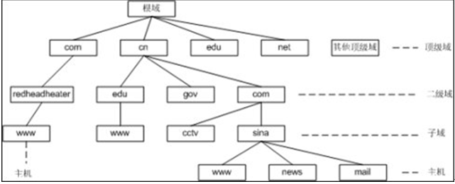
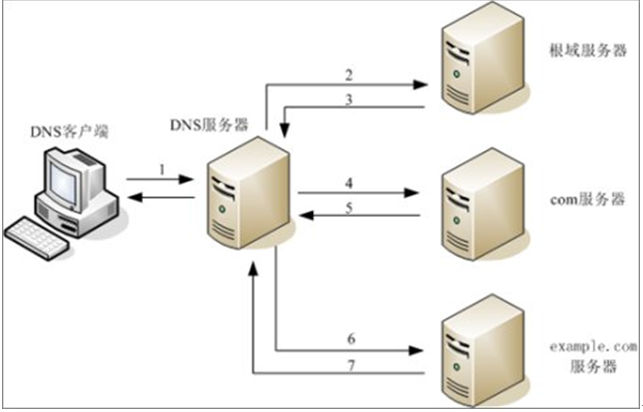
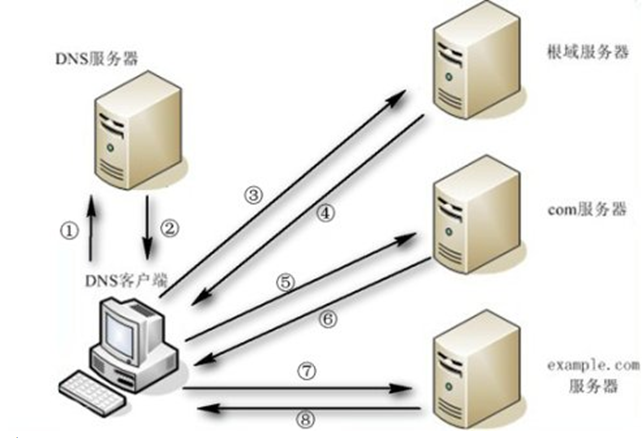

# DNS

**1.简介**

>DNS（Domain Name System，域名系统），因特网上作为域名和IP地址相互映射的一个分布式数据库，能够使用户更方便的访问互联网，而不用去记住能够被机器直接读取的IP数串。通过主机名，最终得到该主机名对应的IP地址的过程叫做域名解析（或主机名解析）。

**2.原理**
```
<1> 客户机提交域名解析请求，并将该请求发送给本地的域名服务器。
<2> 当本地的域名服务器收到请求后，就先查询本地的缓存。如果有查询的DNS信息记录，则直接返回查询的结果。如果
没有该记录，本地域名服务器就把请求发给根域名服务器。
<3> 根域名服务器再返回给本地域名服务器一个所查询域的顶级域名服务器的地址。
<4> 本地服务器再向返回的域名服务器发送请求。
<5> 接收到该查询请求的域名服务器查询其缓存和记录，如果有相关信息则返回客户机查询结果，否则通知客户机下级的
域名服务器的地址。
<6> 本地域名服务器将查询请求发送给返回的DNS服务器。
<7> 域名服务器返回本地服务器查询结果（如果该域名服务器不包含查询的DNS信息，查询过程将重复<6>、<7>步骤，直
到返回解析信息或解析失败的回应）。
<8> 本地域名服务器将返回的结果保存到缓存，并且将结果返回给客户机。
```


**3.正向解析与反向解析**

```
1）正向解析
正向解析是指域名到IP地址的解析过程。
```
```
2）反向解析
反向解析是从IP地址到域名的解析过程。反向解析的作用为服务器的身份验证。
```
**4.DNS查询类型**

递归查询: 简单的理解就是以最终结果查询，就是返回最终的结果给客户机，而客户机在此阶段是处于等待的状态！


迭代查询：简单的理解就是以最佳的结果查询，意思就是如果DNS服务器能解析就直接以最终结果返回给客户机，如果无法解析则就返回上一级DNS服务器的IP给客户机，由客户机完成查询工作直到得到最终结果！


**5.资源记录**

>为了将名字解析为IP地址，服务器查询它们的区（又叫DNS数据库文件或简单数据库文件）。区中包含组成相关DNS域资源信息的资源记录（RR）。例如，某些资源记录把友好名字映射成IP地址，另一些则把IP地址映射到友好名字。

1）SOA资源记录
>每个区在区的开始处都包含了一个起始授权记录（Start of Authority Record）,简称SOA记录。SOA定义了域的全局参数，进行整个域的管理设置。一个区域文件只允许存在唯一的SOA记录。

SOA资源记录语法格式：

```
区域名（当前）IN 记录类型 SOA 	主域名服务器（FQDN） 管理员邮件地址 （
                                序列号 
                                刷新间隔 
                                重试间隔 
                                过期间隔
                                  TTL）
```

主域名服务器：区域的主DNS服务器的FQDN

管理员：管理区域的负责人的电子邮件。在该电子邮件名称中使用英文句号“.”代替符号“@”。

序列号：该区域文件的修订版本号。每次区域中的资源记录改变时，这个数字便会增加，每次区域改变时增加这个值非常重要，它使部分区域改动或完全修改的区域都可以在后续传输中复制到其他辅助DNS服务器上。

刷新间隔：以秒计算的时间，辅助DNS服务器请求与源服务器同步的等待时间。这个域的默认时间是900秒（15分钟）。

重试间隔：以秒计算时间，辅助DNS服务器在请求区域传输失败后，等待多长时间再次请求区域传输时间。通常，这个时间短于刷新间隔。默认值为600秒（10分钟）。

过期间隔：以秒计算时间，当这个时间到期时，如果辅助DNS服务器还无法与源服务器进行区域传输，则辅助DNS服务器会把它的本地数据当作不可靠数据。默认值为86400秒（24小时）。

最小（默认）TTL：区域的默认生存时间（TTL）和缓存否定应答名称查询的最大间隔。默认值为3600秒（1小时）

2）NS资源记录

>名称服务器（NS）资源记录表示该区的授权服务器，它们表示SOA资源记录中指定的该区的主和辅助服务器，也表示了任何授权区的服务器。每个区在区根处至少包含一个NS记录。

NS资源记录语法格式：
```
 区域名   IN    NS      完整主机名（FQDN）
```

3）A资源记录
 
>把FQDN映射到IP地址

A资源记录语法格式：

```
完整主机名（FQDN）   IN   A   IP地址
```

4）PTR资源记录
>相对于A资源记录，该记录与A记录相反，用于查询IP地址与主机名的对应关系。

PTR资源记录语法格式：
```
IP地址      IN      PTR      主机名（FQDN）
```

5）CNAME资源记录
>规范名字（CNAME）资源记录创建特定FQDN的别名。用户可以使用CNAME记录来隐藏用户网络的实现细节，使连接的客户机无法知道。别名（CNAME）资源记录用于为某个主机指定一个别名。例如管理员告知公司的首页为www.abc.com，而实际在访问时访问的是www1.abc.com主机。该资源记录经常用于在同一区域的A资源记录中的主机需要重命名时或者为多台主机（例如一组WWW服务器）提供相同的别名。

CNAME资源记录语法格式：
```
别名   IN   CNAME   主机名
```
6）MX资源记录
>邮件交换（MX）资源记录为DNS域名指定邮件交换服务器。mx  number的值越小，优先级越高（优先级 0-99）。

MX资源记录语法格式：
```
区域名      IN      MX      优先级（数字）      邮件服务器名称（FQDN）
```

**7.type字段指定区域的类型**

type字段指定区域的类型，对于区域的管理至关重要，一共分为六种：
```
Master：主DNS服务器：拥有区域数据文件，并对此区域提供管理数据
Slave：辅助DNS服务器：拥有主DNS服务器的区域数据文件的副本，辅助DNS服务器会从主DNS服务器同步所有区域数据。
Stub：stub区域和slave类似，但其只复制主DNS服务器上的NS记录而不像辅助DNS服务器会复制所有区域数据。
Forward：一个forward zone是每个域的配置转发的主要部分。一个zone语句中的type forward可以包括一个forward和/或forwarders子句，它会在区域名称给定的域中查询。如果没有forwarders语句或者forwarders是空表，那么这个域就不会有转发，消除了options语句中有关转发的配置。
Hint：根域名服务器的初始化组指定使用线索区域hint zone
```

**8.域维护**
>全量传输AXFR(full zone transfer)：全量传输时，从域名服务器从主域名服务器上请求zone文件，poll的时间间隔由SOA记录中的refresh标签定义。请求zone文件的过程是从域名服务器向主域名服务器发送查询来实现，如果主域名服务器中SOA记录中的序列号(serial number标签定义)大于从域名服务器SOA记录的序列号，从域名服务器就会向主域名服务器发送全量传输请求。

>增量传输IXFR(incremental zone transfer)：传递非常大的zone文件是非常耗资源的（时间、带宽等），尤其是只有zone中的一个记录改变的时候，没有必要传递整个zone文件，增量传输是允许主域名服务器和从域名服务器之间只传输那些改变的记录。

**9.mNDS**
>mDNS即组播DNS（multicast DNS）。使用5353端口，在内网没有DNS服务器时，就会出现此组播信息。在一个没有常规DNS服务器的小型网络内，可以使用mDNS来实现类似DNS的编程接口、包格式和操作语义。