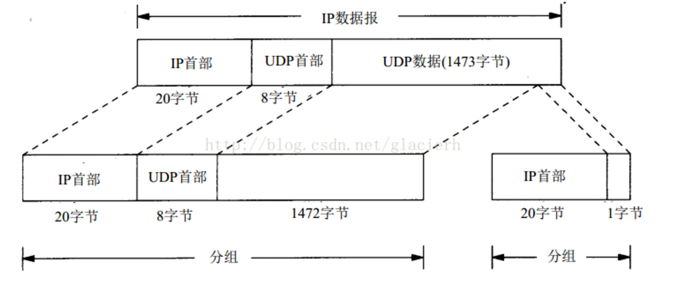

# IP fragmentation

**1.简介**
>以太网的MTU是1500，如果IP层有数据包要传，而且数据包的长度超过了MTU，那么IP层就要对数据包进行分片（fragmentation）操作，使每一片的长度都小于或等于MTU。我们假设要传输一个UDP数据包，以太网的MTU为1500字节，一般IP首部为20字节，UDP首部为8字节，数据的净荷（payload）部分预留是1500-20-8=1472字节。如果数据部分大于1472字节，就会出现分片现象。

**2.原理**
>IP分片发生在IP层，不仅源端主机会进行分片，中间的路由器也有可能分片，因为不同的网络的MTU是不一样的，如果传输路径上的某个网络的MTU比源端网络的MTU要小，路由器就可能对IP数据报再次进行分片。而分片数据的重组只会发生在目的端的IP层。

在IP首部有4个字节是用于分片的，如下图所示。前16位是IP数据报的标识，同一个数据报的各个分片的标识是一样的，目的端会根据这个标识来判断IP分片是否属于同一个IP数据报。中间3位是标志位，其中有1位用来表示是否有更多的分片，如果是最后一个分片，该标志位为0，否则为1。后面13位表示分片在原始数据的偏移，这里的原始数据是IP层收到的传输的TCP或UDP数据，不包含IP首部。


需要注意的，在分片的数据中，传输层的首部只会出现在第一个分片中，如下图所示。因为传输层的数据格式对IP层是透明的，传输层的首部只有在传输层才会有它的作用，IP层不知道也不需要保证在每个分片中都有传输层首部。所以，在网络上传输的数据包是有可能没有传输层首部的。


**3.避免IP分片**

>在网络编程中，我们要避免出现IP分片，那么为什么要避免呢？原因是IP层是没有超时重传机制的，如果IP层对一个数据包进行了分片，只要有一个分片丢失了，只能依赖于传输层进行重传，结果是所有的分片都要重传一遍，这个代价有点大。由此可见，IP分片会大大降低传输层传送数据的成功率，所以我们要避免IP分片。

```
对于UDP包，我们需要在应用层去限制每个包的大小，一般不要超过1472字节，即以太网MTU（1500）—UDP首部（8）—IP
首部（20）。
```
```
对于TCP数据，应用层就不需要考虑这个问题了，因为传输层已经帮我们做了。在建立连接的三次握手的过程中，连接双方
会相互通告MSS（Maximum Segment Size，最大报文段长度），MSS一般是MTU—IP首部（20）—TCP首部（20），每次发
送的TCP数据都不会超过双方MSS的最小值，所以就保证了IP数据报不会超过MTU，避免了IP分片。
```