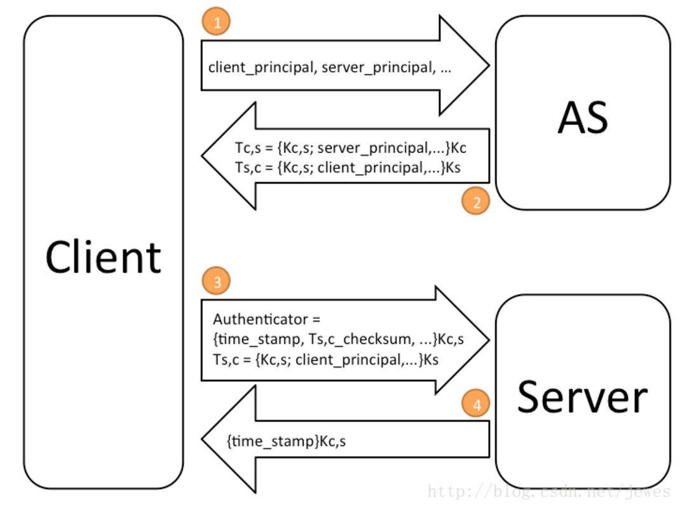
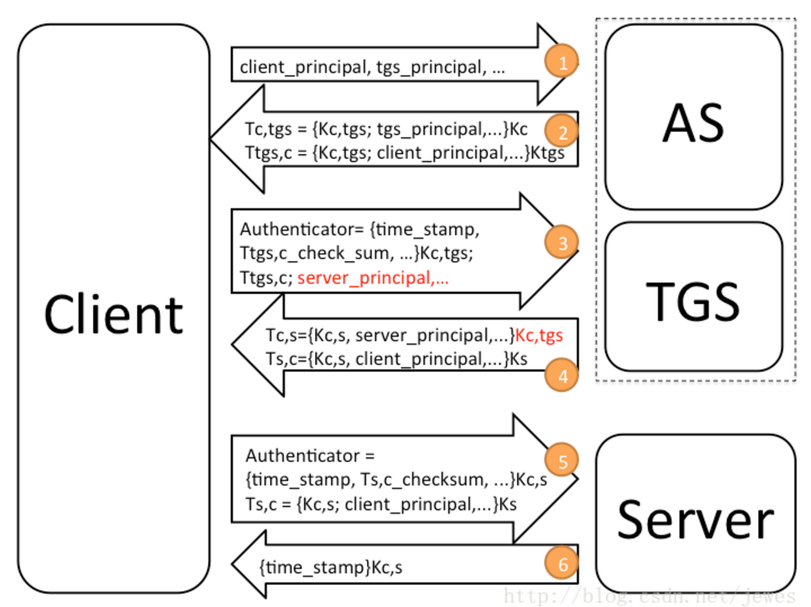

# Kerberos


**1.简介**

>Keberos是为TCP/IP网络系统设计的可信的第三方认证协议。网络上的Keberos服务基于DES对称加密算法，但也可以用其他算法替代。因此，Keberos是一个在许多系统中获得广泛应用的认证协议，Windows2000就支持该协议。

简单地说，Kerberos提供了一种单点登录(SSO)的方法。考虑这样一个场景，在一个网络中有不同的服务器，比如，打印服务器、邮件服务器和文件服务器。这些服务器都有认证的需求。很自然的，不可能让每个服务器自己实现一套认证系统，而是提供一个中心认证服务器（AS-Authentication Server）供这些服务器使用。这样任何客户端就只需维护一个密码就能登录所有服务器。

因此，在Kerberos系统中至少有三个角色：认证服务器（AS），客户端（Client）和普通服务器（Server）。客户端和服务器将在AS的帮助下完成相互认证。

在Kerberos系统中，客户端和服务器都有一个唯一的名字，叫做Principal。同时，客户端和服务器都有自己的密码，并且它们的密码只有自己和认证服务器AS知道。

<br>

**2.简化的Kerberos认证流程**



（1）. 客户端向服务器端发起请求，请求的内容是：我是谁（客户端的principal），我要和谁通信（服务器的principal）

（2）. AS收到请求以后，随机生成一个密码Kc,s (Session Key),并且生成了以下两个票据（Ticket）返回给客户端：

```
Tc,s={Kc,s; server_principal}Kc 	 #该票据是给客户端的，大括号里面为票据中的内容，后面的Kc为客户端的密
码 ，表示该票据用客户端的密码加密了。
Ts,c={Kc,s; client_principal}Ks  	#大括号里面为票据中的内容，后面的Ks为服务器的密码，表示该票据用服务
器的密码加密了。该票据是给服务器的，但是AS并不直接给服务器，而是交给了客户端再由客户端交给服务器。因为该票据由服
务器的密码加密了，所以客户端无法伪造和篡改。
```

（3）. 客户端拿到了第二步中的两个票据后，首先用自己的密码解开票据Tc,s得到Kc,s，然后生成一个认证因子(Authenticator),其内容如下：

```
Authenticator: {time_stamp;Ts,c_checksum;}Kc,s  
```

>其中主要包括当前时间和Ts,c的校验码，并且Kc,s加密。客户端将Authenticator和Ts,c同时发给服务器。


（4）.服务器首先用自己的密码解开Ts,c，拿到SessionKey Kc,s，然后用Kc,s解开Authenticator，并做如下检查：

```
a.检查Authenticator中的时间戳是不是在当前时间上下5分钟以内，并且检查该时间戳是否首次出现。如果该时间戳不是第一
次出现，那说明有人截获了之前客户端发送的内容，进行Replay攻击。
b.检查checksum是否正确。如果都正确，客户端就通过了认证。
服务器段可选择性地给客户端回复一条消息来完成双向认证，内容如下：
{time_stamp}Kc,s  
其中包括客户端发送过去的时间戳，并且用 Kc,s加密。
```

（5）.客户端通过解开该消息，通过比较服务器返回的时间戳和自己发送过去的时间戳是否一致，来验证服务器。

（6）.通过以上4个步骤，客户端和服务器就完成了双向认证。随后，客户端和服务器就可以用session key来加密需要传输的内容。

<br>

**3.完整的Kerberos认证流程**

上一节介绍的流程已经能够完成客户端和服务器的相互认证。但是，比较不方便的是每次认证都需要客户端输入自己的密码。

在Kerberos系统中，引入了一个新的角色叫做：票据授权服务(TGS - Ticket Granting Service)，它的地位类似于一个普通的服务器，只是它提供的服务是为客户端发放用于和其他服务器认证的票据。

这样，Kerberos系统中就有四个角色：认证服务器（AS），客户端（Client），普通服务器（Server）和票据授权服务（TGS）。

现在客户端初次和服务器通信的认证流程分成了以下6个步骤：




>注：虽然上图中把AS和TGS画成了两个框，但实现上它们是可以做到一个服务里面的。


（1）. 客户端向AS发起请求，请求内容是：

```
我是谁（客户端的principal），我要和票据授权服务通信（TGS的principal）等
```

（2）. AS收到请求后，随机生成一个密码Session Key(Kc,tgs)，并生成以下两个Ticket返回给客户端：

```
Tc,tgs={Kc,tgs; tgs_principal; ...} Kc 		#该票据是给客户端的，大括号里面为票据中的内容，后面的Kc为客
户端的密码，表示该票据用客户端的密码加密了。
Ttgs,c={Kc,tgs; client_principal;...} Ktgs 		#该票据是给TGS，大括号里面为票据中的内容，后面的
Ktgs为TGS的密码，表示该票据用TGS的密码加密了，只有TGS能解开。
```

>注意：该步骤中得到的Tgs,c就类似于例子中的联票，后面将会通过它来得到一张和其他服务器通信认证的票据。不用再向AS认证

（3）. 客户端用自己的密码解开Tc,tgs，得到Kc,tgs，生成一个Authenticator，并给TGS发起请求，请求内容是包括：

```
Authenticator = {time_stamp, checksum,server_principal}Kc,tgs
server_principal是客户端需要访问的服务器的名字。
```

（4）. TGS收到客户端发送的Authenticator和Ttgs,c后，先用自己的密码解开Ttgs,c，得到Kc,tgs，然后解开Authenticator，对客户端进行认证。如果客户端通过了认证，TGS生成一个客户端和服务器的SessionKey(Kc,s)，同时将组装下面两个票据返回给客户端：

```
Tc,s={Kc,s, server_principal,...}Kc,tgs 		#这是给客户端的票据，Kc,s是客户端与服务器之间的
SessionKey  ，用客户端和TGS之间的SessionKey(Kc,tgs)加密。区别就在这里了，给客户端的票据不再用客户端的密码加
密，而是用客户端和Tgs之间的SessionKey加密。
Ts,c={Kc,s, client_principal}Ks  				#这是给服务器的票据，用服务器的密码加密。
```

（5）. 客户端收到上述两个票据后，用Kc,tgs解开Tc,s得到Kc,s，然后生成一个Authenticator并发送请求给服务器，内容包括：

```
Authenticator={time_stamp, Ts,c_checksum.}Kc,s
```

（6）. 服务器收到请求后，用自己的密码解开Ts得到Kc,s，然后用Kc,s解开Authenticator对客户端进行认证。服务器也可选择性的返回如下信息给客户端来完成双向认证：

```
{time_stamp}Kc,s
```

（7）.这是客户端首次认证的流程，通常客户端会在第2步的时候把相应的票据保存下来，在以后客户端需要认证别的服务器的时候就不需要前面两步，直接从第3步开始。