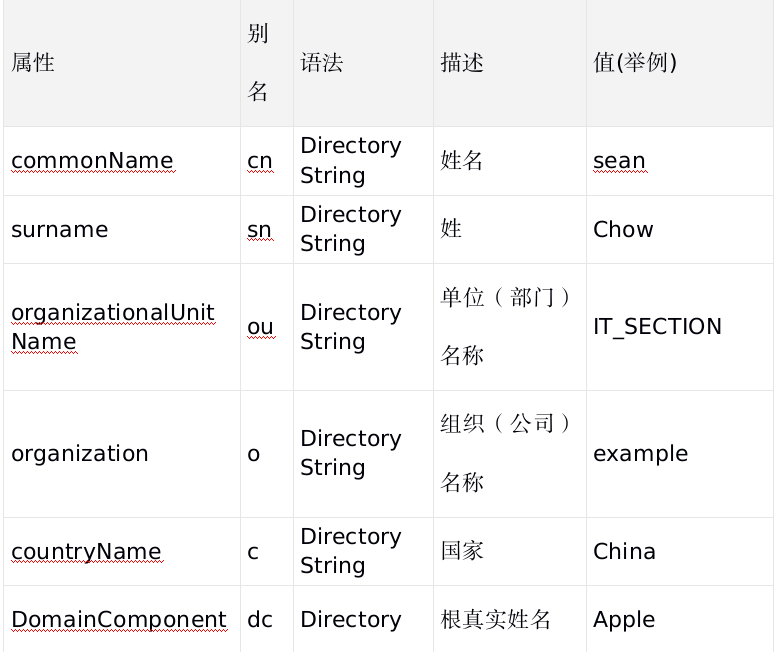

# LDAP


**1.简介**

>LDAP是轻量目录访问协议(Lightweight Directory Access Protocol)的缩写，LDAP是从X.500目录访问协议的基础上发展过来的，目前的版本是v3.0。

>目录是一个为查询、浏览和搜索而优化的专业分布式数据库，它呈树状结构组织数据，就好象Linux/Unix系统中的文件目录一样。目录数据库和关系数据库不同，它有优异的读性能，但写性能差，并且没有事务处理、回滚等复杂功能，不适于存储修改频繁的数据。所以目录天生是用来查询的，就好象它的名字一样。

<br>

**2.特点**

* LDAP的结构用树来表示，而不是用表格。正因为这样，就不能用SQL语句了
* LDAP可以很快地得到查询结果，不过在写方面，就慢得多
* LDAP提供了静态数据的快速查询方式
* Client/server模型，Server 用于存储数据，Client提供操作目录信息树的工具
* 这些工具可以将数据库的内容以文本格式（LDAP 数据交换格式，LDIF）呈现在您的面前
* LDAP是一种开放Internet标准，LDAP协议是跨平台的Interent协议

<br>

**3.基本概念**


(1).Entry:条目，也叫记录项，是LDAP中最基本的颗粒，就像字典中的词条，或者是数据库中的记录。通常对LDAP的添加、删除、更改、检索都是以条目为基本对象的。

dn：每一个条目都有一个唯一的标识名（distinguished Name ，DN），如上图中一个 dn："cn=baby,ou=marketing,ou=people,dc=mydomain,dc=org" 。通过DN的层次型语法结构，可以方便地表示出条目在LDAP树中的位置，通常用于检索。

rdn：一般指dn逗号最左边的部分，如cn=baby。

Base DN：LDAP目录树的最顶部就是根，也就是所谓的“Base DN"，如"dc=mydomain,dc=org"。

(2).Attribute

每个条目都可以有很多属性（Attribute），比如常见的人都有姓名、地址、电话等属性。每个属性都有名称及对应的值，属性值可以有单个、多个，比如你有多个邮箱。

属性不是随便定义的，需要符合一定的规则，而这个规则可以通过schema制定



(3).ObjectClass

对象类是属性的集合，LDAP预想了很多人员组织机构中常见的对象，并将其封装成对象类。比如人员（person）含有姓（sn）、名（cn）、电话(telephoneNumber)、密码(userPassword)等属性，单位职工(organizationalPerson)是人员(person)的继承类，除了上述属性之外还含有职务（title）、邮政编码（postalCode）、通信地址(postalAddress)等属性。

通过对象类可以方便的定义条目类型。每个条目可以直接继承多个对象类，这样就继承了各种属性。

对象类同时也规定了哪些属性是基本信息，必须含有(Must 活Required，必要属性)：哪些属性是扩展信息，可以含有（May或Optional，可选属性）。

对象类有三种类型：结构类型（Structural）、抽象类型(Abstract)和辅助类型（Auxiliary）。结构类型是最基本的类型，它规定了对象实体的基本属性，每个条目属于且仅属于一个结构型对象类。抽象类型可以是结构类型或其他抽象类型父类，它将对象属性中共性的部分组织在一起，称为其他类的模板，条目不能直接集成抽象型对象类。辅助类型规定了对象实体的扩展属性。


下面是inetOrgPerson对象类的在schema中的定义，可以清楚的看到它的父类SUP和可选属性MAY、必要属性MUST(继承自organizationalPerson)，关于各属性的语法则在schema中的attributetype定义。

```
objectclass     ( 2.16.840.1.113730.3.2.2
    NAME 'inetOrgPerson'
    DESC 'RFC2798: Internet Organizational Person'
    SUP organizationalPerson
    STRUCTURAL
MAY (audio $ businessCategory $ carLicense $ departmentNumber )
)
```

<br>

**4.LDIF**

(1).LDIF 文件特点

* LDIF 文件每行的结尾不允许有空格或者制表符。
* LDIF 文件允许相关属性可以重复赋值并使用。
* LDIF 文件以.ldif 结尾命名。
* LDIF 文件中以#号开头的一行为注释，可以作为解释使用。
* LDIF 文件所有的赋值方式为：属性:[空格]属性值。
* LDIF 文件通过空行来定义一个条目，空格前为一个条目，空格后为另一个条目的开始。

(2).LDIF（LDAP Data Interchange Format，数据交换格式）是LDAP数据库信息的一种文本格式，用于数据的导入导出，每行都是“属性: 值”对

```
dn: 条目名
属性描述: 值
属性描述: 值
属性描述: 值
......
```

dn行类似于关系数据库中一条记录的关键字，不能与其他dn重复。一个LDIF文件中可以包含多个条目，每个条目之间用一个空行分隔。

```
dn: dc=dlw, dc=com
objectclass: top
objectclass: dcobject
objectclass: organization
dc: dlw
o: dlw,Inc
```

第1行的dn定义该条目的标识。
第2～4行定义该条目的objectcCass，可以定义多个属性，如上面代码中定义了3个objectClass。条目的属性根据objectClass的不同而不同，有的objectClass有必须设置的属性。在2～4行的3个objectClass中，top没有必须定义的属性，dcobject必须定义属性dc，用来表示一个域名的部分，而organization必须定义属性o，用来表示一个组织的名称。
根据objectClass的要求，第5、6行分别定义属性dc和属性o的值。