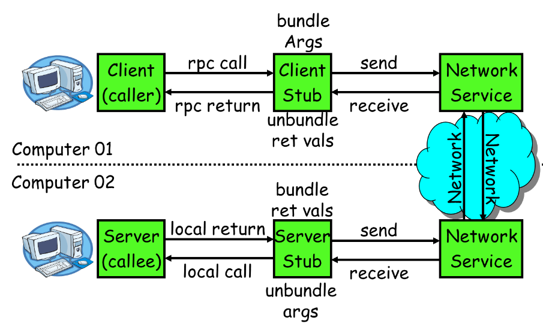

# RPC

**1.简介**

>RPC（Remote Procedure Call Protocol）——远程过程调用协议，它是一种通过网络从远程计算机程序上请求服务，而不需要了解底层网络技术的协议。远程过程调用（RPC）信息协议由两个不同结构组成：调用信息和答复信息。

(1).RPC 调用信息：每条远程过程调用信息包括以下无符号整数字段，以独立识别远程过程：

```
程序号（Program number）
程序版本号（Program version number）
过程号（Procedure number）
```

(2).RPC 答复信息：RPC 协议的答复信息的改变取决于网络服务器对调用信息是接收还是拒绝

<br>

**2.流程**



```
1）服务消费方（client）调用以本地调用方式调用服务；
2）client stub接收到调用后负责将方法、参数等组装成能够进行网络传输的消息体；
3）client stub找到服务地址，并将消息发送到服务端；
4）server stub收到消息后进行解码；
5）server stub根据解码结果调用本地的服务；
6）本地服务执行并将结果返回给server stub；
7）server stub将返回结果打包成消息并发送至消费方；
8）client stub接收到消息，并进行解码；
9）服务消费方得到最终结果。
```