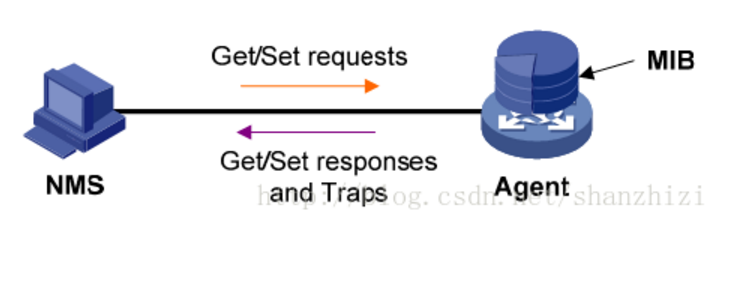
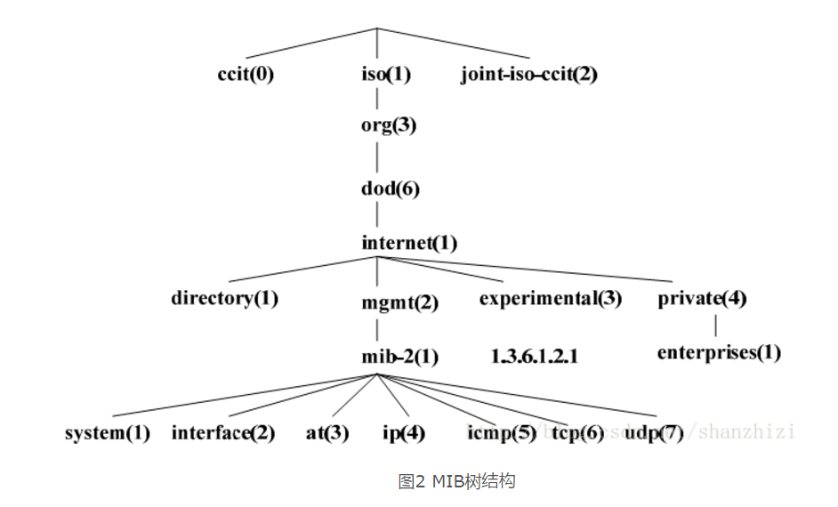
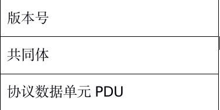
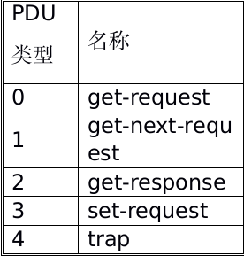
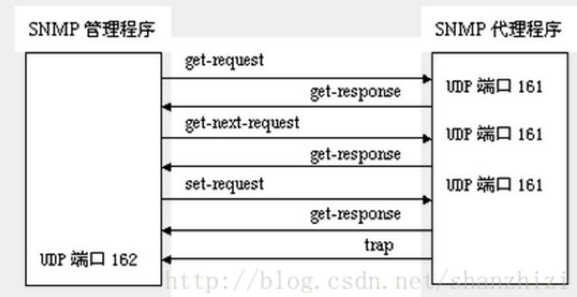

# SNMP

**1.简介**

>简单网络管理协议（SNMP，Simple Network Management Protocol ）是TCP/IP协议簇的一个应用层协议。在1988年被制定，并被Internet体系结构委员会（IAB）采纳作为一个短期的网络管理解决方案；由于SNMP的简单性，在Internet时代得到了蓬勃的发展，1992年发布了SNMPv2版本，以增强SNMPv1的安全性和功能。现在，已经有了SNMPv3版本。
一套完整的SNMP系统主要包括管理信息库（MIB）、管理信息结构（SMI）及SNMP报文协议。


**2.MIB**

>管理信息库MIB：任何一个被管理的资源都表示成一个对象，称为被管理的对象。MIB是被管理对象的集合。它定义了被管理对象的一系列属性：对象的名称、对象的访问权限和对象的数据类型等。每个SNMP设备（Agent）都有自己的MIB。MIB也可以看作是NMS（网管系统）和Agent之间的沟通桥梁。它们之间的关系如图1所示。



MIB文件中的变量使用的名字取自ISO和ITU管理的对象标识符（object identifier）名字空间。它是一种分级树的结构。如图2所示，第一级有三个节点：ccitt、iso、iso-ccitt。低级的对象ID分别由相关组织分配。一个特定对象的标识符可通过由根到该对象的路径获得。一般网络设备取iso节点下的对象内容。如名字空间ip结点下一个名字为ipInReceives的MIB变量被指派数字值3，因而该变量的名字为：
```
     		 iso.org.dod.internet.mgmt.mib.ip.ipInReceives
```
相应的数字表示（对象标识符OID，唯一标识一个MIB对象）为：1.3.6.1.2.1.4.3


**3.SMI**

>管理信息结构（SMI）:SMI定义了SNMP框架所用信息的组织、组成和标识，它还为描述MIB对象和描述协议怎样交换信息奠定了基础。

SMI定义的数据类型：
```
◆ 简单类型（simple）
Integer：整型是-2,147,483,648~2,147,483,647的有符号整数
octet string: 字符串是0~65535个字节的有序序列
OBJECT IDENTIFIER: 来自按照ASN.1规则分配的对象标识符集
```
```
◆ 简单结构类型（simple-constructed）
SEQUENCE 用于列表。这一数据类型与大多数程序设计语言中的“structure”类似。一个SEQUENCE包括0个或更多元素，
每一个元素又是另一个ASN.1数据类型
SEQUENCE OF type 用于表格。这一数据类型与大多数程序设计语言中的“array”类似。一个表格包括0个或更多元素，
每一个元素又是另一个ASN.1数据类型。
```
```
◆ 应用类型（application-wide）
IpAddress: 以网络序表示的IP地址。因为它是一个32位的值，所以定义为4个字节；
counter：计数器是一个非负的整数，它递增至最大值，而后回零。在SNMPv1中定义的计数器是32位的，即最大值为4，
294，967，295；
Gauge ：也是一个非负整数，它可以递增或递减，但达到最大值时保持在最大值，最大值为232-1；
time ticks：是一个时间单位，表示以0.01秒为单位计算的时间；
例如:
Iso.3.6.1.2.1.1.7.0=INTEGER：76
```

**4.SNMP报文**

SNMP报文结构如下：（编码之前）



```
(1)版本 
写入版本字段的是版本号减1，对于SNMP（即SNMPV1）则应写入0。
(2)共同体（community）
共同体就是一个字符串，作为管理进程和代理进程之间的明文口令，常用的是6个字符“public”。
(3)PDU类型
根据PDU的类型，填入0～4中的一个数字
```



SNMP规定了5种协议数据单元PDU（也就是SNMP报文），用来在管理进程和代理之间的交换。
```
get-request操作：从代理进程处提取一个或多个参数值。
get-next-request操作：从代理进程处提取紧跟当前参数值的下一个参数值。
set-request操作：设置代理进程的一个或多个参数值。
get-response操作：返回的一个或多个参数值。这个操作是由代理进程发出的，它是前面三种操作的响应操作。
trap操作：代理进程主动发出的报文，通知管理进程有某些事情发生。
```
在代理进程端是用熟知端口161俩接收get或set报文，而在管理进程端是用熟知端口162来接收trap报文。

