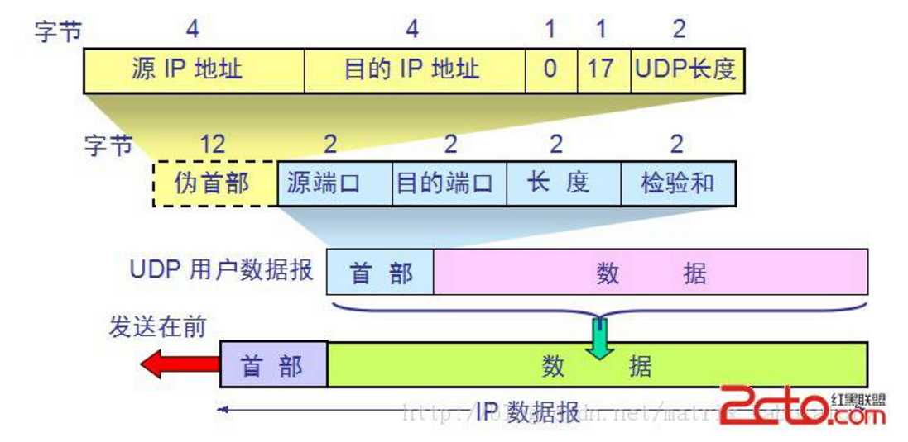

# UDP


**1.UDP (User Datagram Protocol,用户数据报协)**

(1) 特点：
```
UDP时面向无连接的，不需要建立连接就可以传输数据
UDP尽最大可能交付，不保证可靠交付
UDP是面向报文，对应用层传输的报文添加首部后就直接发送，不合并不拆分
UDP没有拥塞控制
UDP支持一对一，一对多，多对一，多对多
UDP首部八个字节，开销小
```

(2)UDP首部格式


